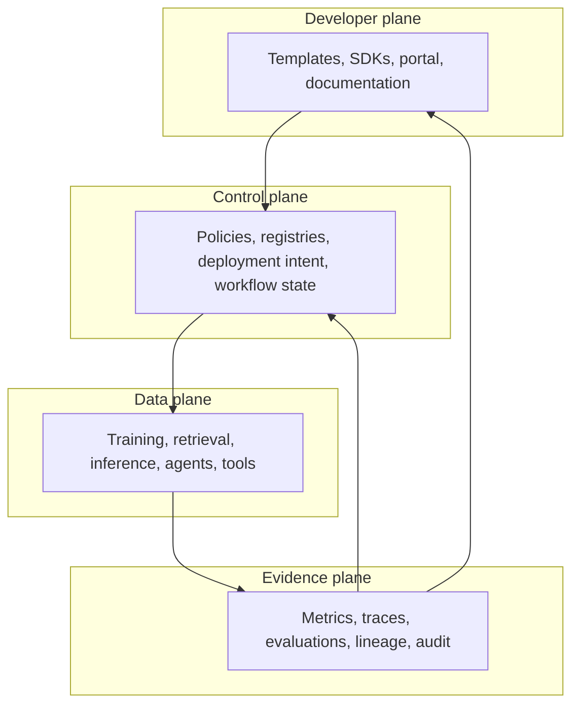
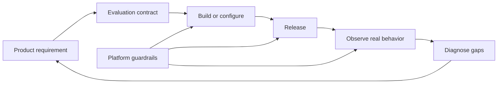

# Chapter 00: Engineering Foundations

AI platform engineering is the discipline of making model-backed systems repeatable, safe, and operable. It combines software delivery, data engineering, machine learning operations, infrastructure, security, and product operations.

The platform is not the model. It is the system that allows teams to move from an idea to a measured production capability without rebuilding identity, delivery, evaluation, observability, and governance for every application.

## The engineering problem

A prototype can call a model from a notebook. A production system must answer harder questions:

- Which code, model, prompt, dataset, and configuration produced this result?
- Was the caller allowed to access the data and invoke the tool?
- How does the system behave when a provider, index, or downstream API fails?
- What proves that a new release is better than the current one?
- What limits cost, latency, and the number of autonomous actions?
- Who owns the service, the data, the model decision, and the incident?
- Can the complete release be rolled back without reconstructing it manually?

These are platform questions because the answers should be consistent across products.

## Platform, product, and provider

Keep three boundaries clear.

The AI provider supplies a model API or runtime. It may also supply storage, evaluation, safety, or agent features. Provider capabilities remain external dependencies with their own limits, failure modes, and data policies.

The platform team supplies reusable internal capabilities. These include model access, deployment, identity, evaluation, observability, policy, templates, and supported operating paths.

The product team owns the user problem and the application outcome. It decides whether an answer is useful, whether a recommendation causes harm, and whether an automated action belongs in the workflow.

The platform can standardize how evaluation runs. It cannot invent the product's definition of correctness.

## Shared platform capabilities

A mature AI platform commonly owns or coordinates:

### Delivery and provenance

- source control, review policy, and automated checks;
- immutable build artifacts and release manifests;
- software bills of materials and artifact signatures;
- environment promotion and rollback; and
- traceability across code, models, prompts, data, and configuration.

### Runtime and infrastructure

- compute, accelerator, network, and storage provisioning;
- container and workload orchestration;
- model serving, queues, gateways, and caches;
- capacity management, quotas, and tenant isolation; and
- service discovery, secrets, and workload identity.

### ML and AI lifecycle

- dataset and feature contracts;
- experiment tracking and model registry;
- training, evaluation, and promotion pipelines;
- prompt, retrieval, agent, and tool versioning; and
- online feedback and regression analysis.

### Trust and operations

- authentication, authorization, and policy enforcement;
- telemetry, audit records, and incident evidence;
- privacy, retention, deletion, and residency controls;
- cost attribution and budgets; and
- service objectives, runbooks, and ownership metadata.

### Developer experience

- service templates and golden paths;
- local development and test environments;
- platform APIs, command-line tools, and documentation;
- supported exceptions and migration paths; and
- feedback channels and platform product metrics.

## Four platform planes

The four-plane model separates user experience, desired state, request execution, and operational evidence.

### Developer plane

The developer plane is how internal users consume the platform. A portal can be part of it, but a portal alone is not a platform. The underlying capabilities need stable APIs and automation contracts.

A weak developer plane exposes infrastructure details without guidance. A strong one makes the common safe choice easy, shows cost and policy before deployment, and provides an escape hatch for justified exceptions.

### Control plane

The control plane stores intent and coordinates change. It includes deployment declarations, model and release registries, policy decisions, workflow state, and environment configuration.

It should not sit synchronously on every request unless required. A control-plane outage must not automatically stop an already deployed inference service.

### Data plane

The data plane performs user-facing or workload-facing work. It includes training jobs, feature computation, retrieval, model inference, tool execution, and media processing.

This plane handles untrusted input and expensive resources. It needs isolation, backpressure, timeouts, quotas, and bounded failure.

### Evidence plane

The evidence plane explains what happened. It combines operational telemetry, evaluation results, lineage, cost records, audit events, and user feedback.

Evidence must connect to the exact release. A metric without model and configuration identity cannot support a release decision or incident investigation.

## The production feedback loop

AI systems change because code changes, providers change models, documents change, users change behavior, and attackers adapt. The operating model must be a loop.

The evaluation contract comes before implementation. It defines success, unacceptable behavior, important slices, operational constraints, and evidence required for promotion.

Production feedback expands the evaluation set. A serious failure should become a reproducible test when privacy and data policy allow it.

## Deterministic and probabilistic boundaries

Use deterministic code for permissions, budgets, validation, state transitions, and irreversible actions. Use models where language interpretation, classification, generation, or flexible planning provides value.

This boundary prevents a common design error: asking the model to obey a rule that the runtime could enforce.

| Concern | Correct enforcement point |
|---|---|
| User authentication | Identity system and application runtime |
| Tenant authorization | Data and tool access layer |
| Token or cost budget | Gateway or orchestration runtime |
| Output structure | Schema validation |
| Tool approval | Policy engine and human workflow |
| Response usefulness | Evaluation and product feedback |
| Language interpretation | Model, with validation where required |

A system prompt may describe a policy to help the model behave. It is not the security boundary.

## Platform as an internal product

Internal users choose the path of least resistance. A mandatory platform can show high adoption while generating private workarounds and support load. Treat engineering teams as customers and observe their work before designing abstractions.

A golden path should remove repeated decisions:

- repository and ownership setup;
- pipeline, infrastructure, and identity wiring;
- default telemetry and dashboards;
- deployment, verification, and rollback;
- policy-compliant configuration; and
- cost and quota visibility.

It should not remove every decision. Product teams still choose their domain contract, evaluation data, service objective, and risk treatment.

Useful platform metrics include:

- time to first successful deployment;
- lead time for a routine model or prompt change;
- golden-path adoption and abandonment;
- change failure and rollback rates;
- support requests per consuming team;
- policy violations detected before production;
- developer satisfaction; and
- cost per successful product outcome.

Counting clusters, pipelines, or portal visits measures inventory, not value.

## Capability maturity

Platform maturity is not a vendor checklist.

### Repeated manual delivery

Teams provision resources and release models differently. Ownership and evidence are incomplete. Incident response depends on individual knowledge.

### Standardized building blocks

Shared modules, pipelines, identity patterns, and telemetry reduce variation. Teams still assemble the parts and understand their contracts.

### Self-service golden paths

Teams can create supported workloads through stable APIs and templates. Policy and cost controls are built into the path. Exceptions are explicit and reviewed.

### Measured platform product

The platform team prioritizes work from adoption, reliability, support, and product outcome data. Capabilities have owners, service levels, deprecation policies, and migration support.

Do not jump directly to a portal. Standardize the underlying contracts first.

## Architecture decision discipline

Record decisions that are expensive to reverse or easy to misunderstand. Useful decision records include:

- managed model API versus self-hosted inference;
- batch, synchronous, asynchronous, or streaming execution;
- retrieval versus fine-tuning;
- workflow versus agentic control;
- shared versus dedicated tenant resources;
- build versus buy for platform capabilities; and
- centralized versus federated ownership.

Each record should state the context, decision, alternatives, consequences, evidence, owner, and review trigger. “Industry best practice” is not evidence.

## Common failure modes

### Building before discovery

The platform team creates abstractions around imagined needs. Product teams bypass them because the path does not match real delivery work.

### Centralizing every decision

The platform becomes an approval queue. Product teams lose ownership while the platform team gains operational load it cannot sustain.

### Self-service without guardrails

Teams can create costly or exposed resources without identity, ownership, policy, or lifecycle controls.

### Guardrails without usable paths

Policies reject work but provide no supported design or clear remediation. Teams work around the control.

### Treating quality as separate from reliability

An endpoint can be available and fast while returning unsupported, harmful, or useless results. Quality signals belong beside latency and errors.

### Hiding cost

The platform reports spend after the fact but does not expose expected unit cost, quota, or saturation behavior during design.

### Confusing tools with capabilities

A collection of cloud consoles and vendor products has no coherent contract, ownership, or user experience. Integration work remains with every product team.

## Chapter checkpoint

Design the responsibility map for a multi-tenant document assistant.

Include:

1. users, product team, platform team, security, data owners, and provider;
2. developer, control, data, and evidence planes;
3. ownership for model access, ingestion, retrieval, evaluation, deployment, incident response, and user feedback;
4. deterministic enforcement points for identity, data access, quotas, and tool approval;
5. one golden path and one justified escape hatch; and
6. five platform metrics tied to internal user outcomes.

## Completion criteria

You are ready to continue when:

- every production responsibility has one accountable owner;
- every critical capability has a defined interface;
- product quality and platform reliability have separate measures;
- model behavior is not trusted to enforce hard controls; and
- the architecture can explain how evidence returns to the next release decision.

