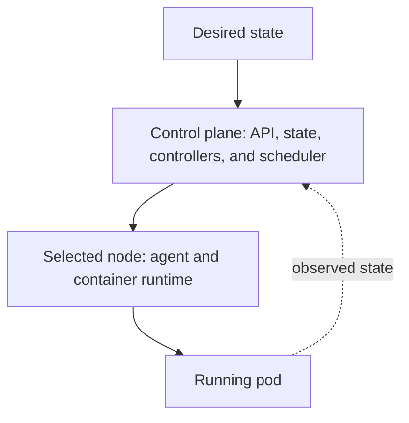
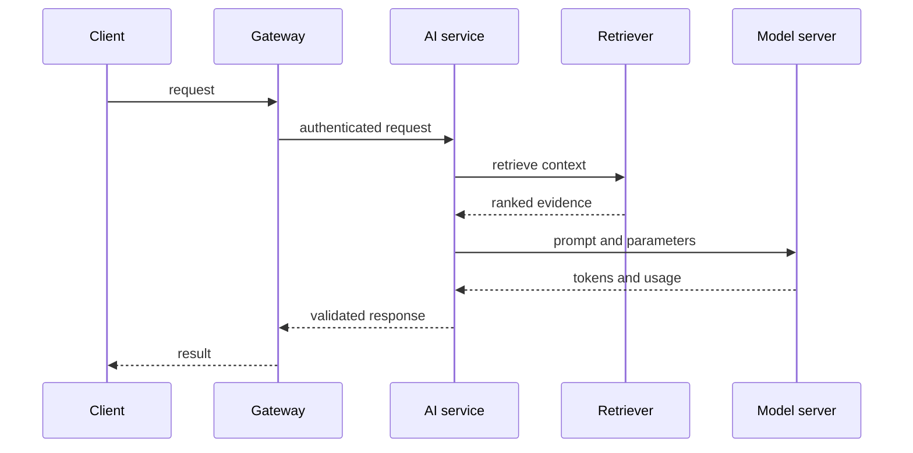

# Chapter 02: Containers, Kubernetes, and Observability

Containers package processes. Kubernetes schedules and reconciles them. Neither makes a service reliable automatically.

## Container contract

A production image should be small, non-root, read-only where possible, and built from a pinned base. Separate build tools from runtime files with multi-stage builds. Expose health endpoints, handle termination signals, and keep configuration outside the image.

Image scanning finds known package vulnerabilities. It does not detect an unsafe application design. Combine vulnerability scanning with secrets checks, dependency review, signing, and runtime restrictions.

## Container images in depth

An image is a set of immutable filesystem layers plus runtime metadata. Layer order affects build cache and size. Copy dependency manifests before frequently changing source files so dependency installation can be reused. Combine package installation and cleanup in the same build step because deleting a file in a later layer does not remove it from earlier layers.

Use multi-stage builds to keep compilers, package managers, test fixtures, and credentials out of the runtime image. The final stage should contain the application, runtime libraries, certificate roots, and little else.

Pin the base image by digest when reproducibility matters. A version tag is useful for maintenance, but the digest identifies the exact content. Establish a process to refresh pinned images when security fixes appear.

Run as a numeric non-root user. Drop Linux capabilities, prevent privilege escalation, use a read-only root filesystem, and mount writable temporary locations explicitly. These controls limit impact; they do not turn containers into a complete security boundary.

### Process behavior

The main process must receive termination signals and exit within the platform's grace period. Stop accepting new work, finish or checkpoint safe in-flight work, flush essential telemetry, and close resources. Avoid shell wrappers that swallow signals.

Keep one primary responsibility per container. Sidecars are justified when their lifecycle must match the workload, but they consume resources and complicate startup, shutdown, and debugging.

### Local multi-service development

A local composition file can connect the API, queue, database, model stub, and telemetry collector. Keep it development-focused. Production orchestration needs identity, policy, scheduling, secrets, and recovery behavior that local composition does not model fully.

## Guided build: package and publish an instrumented API

Build one small service and carry the same immutable image through the rest of this chapter. The service returns a deterministic response so the exercise stays focused on packaging, deployment, and telemetry.

Create `app.py`:

```python
from fastapi import FastAPI
app = FastAPI()


@app.get("/healthz")
def health() -> dict[str, str]:
    return {"status": "ok"}


@app.get("/classify")
def classify(text: str) -> dict[str, str]:
    label = "long" if len(text) > 40 else "short"
    return {"label": label}
```

Create `requirements.txt`:

```text
fastapi
uvicorn
opentelemetry-distro
opentelemetry-exporter-otlp-proto-http
opentelemetry-instrumentation-fastapi
```

For a repeatable workshop, resolve these dependencies once and commit the generated lock file.

Create the container contract:

```dockerfile
FROM python:3.13-slim

WORKDIR /app
COPY requirements.txt .
RUN pip install --no-cache-dir -r requirements.txt
COPY app.py .

RUN useradd --system --uid 10001 appuser
USER 10001

EXPOSE 8000
CMD ["opentelemetry-instrument", "uvicorn", "app:app", "--host", "0.0.0.0", "--port", "8000"]
```

Build and test the image locally:

```bash
docker build -t ai-platform-lab:0.1.0 .
docker run --rm -p 8000:8000 ai-platform-lab:0.1.0
curl 'http://localhost:8000/classify?text=hello'
```

Publish the exact image that passed the local check. The following example uses GitHub Container Registry; Docker Hub uses the same tag-and-push flow with a different registry name.

```bash
export IMAGE=ghcr.io/YOUR_GITHUB_USERNAME/ai-platform-lab:0.1.0
docker tag ai-platform-lab:0.1.0 "$IMAGE"
printf '%s' "$GITHUB_TOKEN" | docker login ghcr.io -u YOUR_GITHUB_USERNAME --password-stdin
docker push "$IMAGE"
docker inspect --format='{{index .RepoDigests 0}}' "$IMAGE"
```

Do not paste a token directly into shell history. Confirm that the registry shows the expected tag and record the resulting digest. Later deployment steps should change the image reference, not rebuild the application.

## Kubernetes architecture

The API server accepts desired state. Controllers reconcile resources toward that state. The scheduler assigns pending pods to nodes. Node agents and the container runtime start and supervise containers. The distributed state store holds cluster state and requires protected backup and recovery.

This reconciliation model is central: controllers repeatedly compare desired and actual state. Operational tooling should declare intent and observe reconciliation instead of performing one-time remote commands.



### Workload controllers

- A Deployment manages interchangeable replicas and rolling updates.
- A StatefulSet provides stable identity and ordered behavior for stateful replicas.
- A Job runs finite work to completion.
- A CronJob creates Jobs on a schedule and needs concurrency and missed-run policy.
- A DaemonSet runs a pod on selected nodes, commonly for infrastructure agents.

Do not run a model training task as a long-lived Deployment merely because Deployments are familiar. Match the controller to the workload lifecycle.

### Services and traffic

A Service provides stable discovery for changing pod endpoints. An ingress or gateway accepts external traffic and applies routing and transport policy. Network policies restrict allowed pod communication when the network implementation enforces them.

Service meshes can add workload identity, traffic control, and telemetry, but they add another distributed system to operate. Use one for a defined requirement rather than as a default badge of maturity.

## Kubernetes contract

For every workload, define:

- requests for scheduling and limits for containment;
- readiness for traffic admission, liveness for deadlock recovery, and startup probes for slow initialization;
- a disruption budget and controlled rollout strategy;
- a service account with minimal permissions;
- network policy and secret delivery; and
- ownership, dashboards, and alerts.

### Requests, limits, and quality of service

The scheduler uses requests to place pods. Limits constrain runtime use. If requests are too low, nodes become overcommitted and unstable. If they are too high, capacity sits unused and scheduling fails unnecessarily.

CPU limits can throttle a latency-sensitive process. Memory limits can terminate it. GPU memory is usually managed by the process and device stack rather than a simple Kubernetes memory limit. Measure real workload behavior before selecting values.

Namespace quotas and limit ranges prevent one team from consuming all cluster capacity. Priority classes and preemption require careful governance because every team considers its workload important.

### Probes

Readiness decides whether an instance should receive traffic. Liveness decides whether restarting the process is likely to recover it. Startup probes protect slow initialization from premature liveness failure.

Probe endpoints should be cheap and deterministic. A liveness probe should not fail because an optional downstream service is unavailable; restarting every replica can turn a dependency incident into a total outage.

### Configuration and secrets

ConfigMaps hold non-sensitive configuration. Secrets are API objects with different handling semantics, not automatic encryption or perfect protection. Encrypt cluster data at rest, restrict access, avoid broad environment-variable exposure, and prefer external secret delivery or short-lived workload identity where appropriate.

Version configuration that changes behavior and attach its identity to the release. Mounting a mutable configuration source can change a running service outside the deployment record.

### Storage

Persistent volumes decouple storage lifecycle from a pod. Storage classes describe provisioners and service characteristics. Define backup, restore, expansion, encryption, topology, and deletion policy. A mounted volume is not a backup.

Stateful AI services such as vector databases need quorum, placement, recovery, and version-upgrade planning. Managed storage may reduce operational load but does not remove data ownership or recovery testing.

GPU workloads need additional decisions: device plugin or operator, node labels and taints, topology awareness, model-loading time, GPU memory headroom, and queue behavior during saturation.

Schedule accelerator workloads onto dedicated pools when isolation or cost control requires it. Taints prevent general workloads from occupying scarce nodes. Topology constraints reduce communication penalties for distributed jobs. Time slicing or partitioning can increase utilization but may weaken isolation and create noisy-neighbor behavior.

Scale inference on demand signals that represent pressure: queue depth, waiting time, active sequences, or accelerator utilization. CPU-based autoscaling often misses the real bottleneck. Include cold-start and model-download time in the scaling model.

## Guided build: deploy the published image to local Kubernetes

Create a disposable local cluster with `kind`, then deploy the image from the registry. Replace the image placeholder with the digest captured in the previous exercise.

```bash
kind create cluster --name ai-platform-lab
```

Create `service.yaml`:

```yaml
apiVersion: apps/v1
kind: Deployment
metadata:
  name: ai-platform-lab
spec:
  replicas: 2
  selector:
    matchLabels:
      app: ai-platform-lab
  template:
    metadata:
      labels:
        app: ai-platform-lab
    spec:
      securityContext:
        runAsNonRoot: true
      containers:
        - name: api
          image: ghcr.io/YOUR_GITHUB_USERNAME/ai-platform-lab@sha256:REPLACE_ME
          ports:
            - containerPort: 8000
          env:
            - name: OTEL_SERVICE_NAME
              value: ai-platform-lab
            - name: OTEL_EXPORTER_OTLP_ENDPOINT
              value: http://otel-lgtm:4318
            - name: OTEL_EXPORTER_OTLP_PROTOCOL
              value: http/protobuf
          readinessProbe:
            httpGet:
              path: /healthz
              port: 8000
          livenessProbe:
            httpGet:
              path: /healthz
              port: 8000
          resources:
            requests:
              cpu: 100m
              memory: 128Mi
            limits:
              cpu: 500m
              memory: 256Mi
          securityContext:
            allowPrivilegeEscalation: false
            readOnlyRootFilesystem: true
            capabilities:
              drop: ["ALL"]
---
apiVersion: v1
kind: Service
metadata:
  name: ai-platform-lab
spec:
  selector:
    app: ai-platform-lab
  ports:
    - port: 8000
      targetPort: 8000
```

Apply it and verify reconciliation before sending traffic:

```bash
kubectl apply -f service.yaml
kubectl rollout status deployment/ai-platform-lab
kubectl get pods,service
kubectl port-forward service/ai-platform-lab 8000:8000
curl 'http://localhost:8000/classify?text=observe-this-request'
```

Delete one pod and watch the Deployment replace it. Then temporarily change the readiness path to an invalid value and observe that the pods stay running but leave the Service endpoints. Restore the valid probe before continuing.

## Signals and questions

Metrics answer how much and how often. Logs record discrete events. Traces show causal paths through a request. Profiles explain resource consumption. Use OpenTelemetry-compatible instrumentation when possible so telemetry is not locked to one backend.

For an AI request, trace the complete path:



Attach release, model, prompt, tenant, and evaluation-safe request attributes. Do not place raw sensitive prompts into telemetry by default.

### Metrics

Counters track totals such as requests and failures. Gauges represent current values such as queue depth. Histograms represent distributions such as latency or token count. Choose bucket boundaries that support the service objective.

Avoid high-cardinality labels such as request IDs, full URLs, user text, or unbounded model-generated values. Put request-specific identifiers in traces or structured logs.

### Logs

Emit structured events with timestamp, severity, service, release, trace identifier, event name, and bounded fields. Log decisions and failures, not every internal detail. Define redaction before data leaves the process.

### Traces

Propagate context across HTTP, queues, retrieval, model calls, and tools. Sampling routine traffic controls volume, but error and security events may need different retention. Trace attributes should support diagnosis without copying sensitive content.

### Dashboards and alerts

Start with service objectives and dependency health. A dashboard should help answer whether users are affected, which path is failing, what changed, and where saturation occurs.

Page on urgent, actionable user impact. Send lower-priority capacity or quality trends to normal work queues. Every page needs an owner and runbook.

## Guided build: inspect request traces in Grafana

For this learning environment, run Grafana's OpenTelemetry learning stack inside the cluster. It combines an OTLP receiver with Grafana and compatible telemetry backends; treat it as a local lab, not a deployment pattern for a shared environment.

```bash
kubectl create deployment otel-lgtm --image=grafana/otel-lgtm:latest
kubectl expose deployment otel-lgtm \
  --name=otel-lgtm \
  --type=ClusterIP \
  --port=4318 \
  --target-port=4318
kubectl port-forward deployment/otel-lgtm 3000:3000
```

Restart the API pods after the collector becomes ready, generate several requests, and open `http://localhost:3000`.

```bash
kubectl rollout restart deployment/ai-platform-lab
kubectl port-forward service/ai-platform-lab 8000:8000
for text in short 'this-is-a-longer-input-that-crosses-the-classifier-threshold'; do
  curl "http://localhost:8000/classify?text=$text"
done
```

In Grafana Explore, select the trace backend and filter on `service.name = ai-platform-lab`. Open one trace and identify the HTTP route, duration, status code, and service name. Do not add the query text as an attribute; it is user-controlled and may contain sensitive data.

Create a small dashboard with request count, error count, and latency once those metrics are available from the service. The dashboard is useful only if each panel answers an operational question. Record one screenshot or exported dashboard JSON as evidence that telemetry crossed the application, collector, storage, and visualization boundaries.

## Service objectives

Define indicators around user outcomes: successful task rate, time to first token, end-to-end latency, grounded response rate, and tool completion rate. Infrastructure utilization is diagnostic data, not the user objective.

An SLI is the measurement. An SLO is the target over a window. An SLA is an external commitment with consequences. Keep these terms separate.

Use the error budget to balance reliability and change. Multi-window burn-rate alerts detect both rapid outages and sustained degradation. A monthly success percentage observed only at the end of the month cannot guide operations.

## Rollouts and failure handling

Use rolling updates for compatible changes, canaries for risk-controlled exposure, and blue-green deployment when rapid environment switching justifies duplicate capacity. Set disruption budgets so maintenance does not remove too many healthy replicas, but remember that an impossible budget can block node operations.

Graceful degradation may disable expensive features, shorten context, use a smaller approved model, or accept asynchronous processing. The product must define which fallbacks are acceptable because they change user-visible behavior.

Test node loss, pod termination, dependency timeout, registry failure, and telemetry outage. A platform that has never exercised recovery has a recovery theory, not a recovery capability.

## Failure modes

- A liveness probe restarts a healthy service during model loading
- CPU autoscaling ignores an inference queue bound by GPU memory
- logs contain personal data or secrets
- high-cardinality labels overload the metrics backend
- alerts fire on resource usage without showing user impact

## Checkpoint

Specify a Kubernetes deployment for an inference API, including probes, resources, termination behavior, security context, and telemetry. Add an SLO and two burn-rate alerts.

Completion means the service can fail, shed load, recover, and leave enough evidence for diagnosis.
