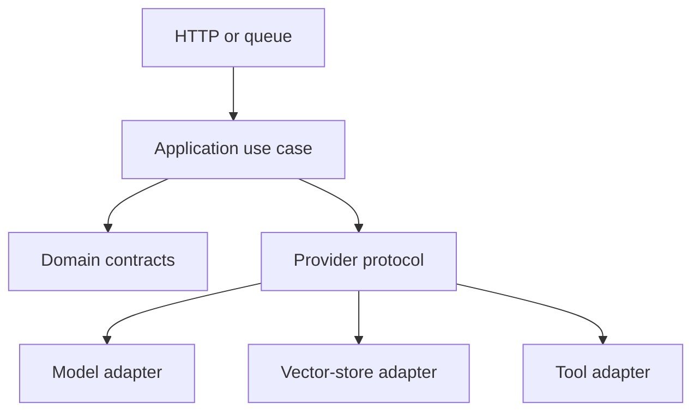

# Chapter 03: Python for AI Services

Python is common in AI systems because its libraries are broad, not because the runtime removes engineering constraints. Production Python needs explicit types, validation, concurrency limits, packaging, and tests.

## Environment and package discipline

Use a project-specific virtual environment and a committed dependency lock. Separate runtime, development, and optional accelerator dependencies. Record the supported Python version and operating platform because binary ML packages are sensitive to interpreter, driver, and architecture differences.

A library package should expose reusable domain code. An application package should define an executable service or job. Use a `pyproject.toml`-based build and install the package in tests instead of relying on the current directory being on the import path.

Keep notebooks as exploration clients. Move reusable loading, transformation, training, and evaluation logic into importable modules with tests. A notebook output is not a reproducible pipeline record.

## Language foundations that matter in services

Prefer small functions with explicit inputs and returns. Use immutable values where practical and avoid shared module-level state. Comprehensions are useful for simple transformations; replace deeply nested expressions with named functions.

Use dataclasses for internal value objects and validated models at external boundaries. Protocols describe required behavior without forcing inheritance. Generators process streams without loading all values into memory. Context managers guarantee resource cleanup when success, failure, or cancellation occurs.

Raise exceptions that describe the domain failure. Translate them to transport-specific status codes at the API boundary. Do not catch `Exception` only to return a generic success-shaped object.

Type hints improve interfaces and tooling but do not validate runtime data. Static checking and runtime validation solve different problems.

## Service boundary

Validate external input before it reaches model code. Use typed request and response models. Separate transport, domain logic, model adapters, and persistence so a provider change does not rewrite the application.

```python
from typing import Protocol
from pydantic import BaseModel, Field

class GenerateRequest(BaseModel):
    text: str = Field(min_length=1, max_length=8_000)
    max_tokens: int = Field(default=256, ge=1, le=1_024)

class GenerateResult(BaseModel):
    text: str
    model: str
    input_tokens: int
    output_tokens: int

class TextGenerator(Protocol):
    async def generate(self, request: GenerateRequest) -> GenerateResult: ...
```

The protocol is the stable application contract. Provider SDK objects stay inside adapters.

## Layered service design

Keep four layers separate:

1. transport parses HTTP, queue, or command input;
2. application logic coordinates the use case;
3. domain types express rules and results; and
4. adapters connect models, databases, vector stores, and external APIs.

Dependency direction points inward. Domain code should not import a web framework or provider SDK. This makes offline tests fast and allows a background worker to reuse the same use case as an HTTP endpoint.



### Configuration

Load configuration once at process startup, validate it, and pass typed settings into components. Keep secrets out of defaults and logs. Distinguish missing configuration from an unavailable downstream dependency so operators receive the correct failure signal.

### Structured output

When code consumes model output, request a schema and validate the returned object. Validation failure is a normal model boundary condition. Decide whether to repair, retry with bounded feedback, fall back, or fail. Never deserialize arbitrary model output into executable objects.

## Concurrency

Async code improves throughput for network-bound work. It does not make CPU-bound preprocessing faster. Put limits around outbound calls with semaphores, bounded queues, timeouts, and cancellation. A service that creates unlimited concurrent model requests moves overload to the provider and increases cost.

Use context managers for resources and generators for streaming. Propagate request cancellation so the model call stops when the client disconnects.

### Async execution model

An event loop runs coroutines until they wait for I/O. A blocking database driver, CPU-heavy parser, or synchronous model SDK blocks every coroutine on that worker. Use async-compatible clients, move bounded blocking work to a thread pool, and move sustained CPU work to separate processes or jobs.

Structured concurrency keeps child tasks tied to a parent request. If one required operation fails, cancel related work. Collect partial results only when the product contract permits them.

Apply timeouts at each dependency and at the end-to-end request. The outer timeout must leave enough time for cleanup and response handling. Retrying after a timeout is safe only when the operation is idempotent or protected by an idempotency key.

### Backpressure

A semaphore caps concurrent provider calls. A bounded queue caps waiting work. Admission control rejects or defers work before memory and latency become unbounded. These controls are more reliable than hoping autoscaling reacts instantly.

Streaming improves time to first result but creates additional states: response started, partial content emitted, validation pending, client disconnected, and provider failed. Design each state explicitly.

## Data and ML code

Prefer vectorized NumPy or dataframe operations for bulk transformation, but keep transformations in named, tested functions. Fit preprocessing only on training data. Serialize the preprocessing contract with the model or make it a versioned service dependency.

NumPy arrays have shape, dtype, and memory layout. Validate all three when a model depends on them. Vectorization reduces Python-loop overhead, but unnecessary copies can dominate memory and latency.

Dataframes are useful for labeled tabular operations. Make column selection and type conversion explicit. Avoid chained transformations whose null and index behavior is unclear. Validate the frame before and after major stages.

Scikit-learn pipelines bind transformations and estimators so training and inference execute the same sequence. Fit only on training data. Cross-validation splits must reflect time, group, or entity boundaries in the real system.

## API implementation concerns

A production inference API needs more than one endpoint. Provide a live check for process health, a readiness check for traffic eligibility, metrics, and version information that does not expose secrets.

Use an application lifecycle hook to create shared clients and load models once. Close resources during shutdown. Do not load a large model in every request handler.

Return a stable error envelope with a machine-readable code, safe message, request identifier, and retry guidance where relevant. Do not expose provider stack traces to clients.

For long-running work, accept a job, return its identifier, process it asynchronously, and provide status or callback delivery. Define job expiry, cancellation, duplicate submission, and result retention.

## Guided build: a typed FastAPI service

FastAPI is useful here because it turns Python type declarations into request validation and an HTTP contract without forcing domain code to depend on the framework. Keep the framework at the transport boundary.

Save the request model, result model, and `TextGenerator` protocol from the earlier service-boundary example in `domain.py`. Then create `main.py`:

```python
import asyncio
from typing import Annotated

from fastapi import Depends, FastAPI, Request
from fastapi.responses import JSONResponse

from domain import GenerateRequest, GenerateResult, TextGenerator


class ProviderUnavailable(Exception):
    pass


class StubGenerator:
    async def generate(self, request: GenerateRequest) -> GenerateResult:
        await asyncio.sleep(0.05)
        return GenerateResult(
            text=f"stub: {request.text}",
            model="learning-stub",
            input_tokens=len(request.text.split()),
            output_tokens=2,
        )


class GenerationService:
    def __init__(self, generator: TextGenerator, concurrency: int = 4) -> None:
        self._generator = generator
        self._slots = asyncio.Semaphore(concurrency)

    async def generate(self, request: GenerateRequest) -> GenerateResult:
        try:
            async with self._slots:
                async with asyncio.timeout(5):
                    return await self._generator.generate(request)
        except TimeoutError as error:
            raise ProviderUnavailable from error


app = FastAPI(title="AI service lab")
service = GenerationService(StubGenerator())


def get_service() -> GenerationService:
    return service


Service = Annotated[GenerationService, Depends(get_service)]


@app.exception_handler(ProviderUnavailable)
async def provider_unavailable(
    request: Request, error: ProviderUnavailable
) -> JSONResponse:
    return JSONResponse(
        status_code=503,
        content={
            "code": "provider_unavailable",
            "message": "Generation is temporarily unavailable",
            "request_id": request.headers.get("x-request-id"),
            "retryable": True,
        },
    )


@app.get("/health/live")
async def live() -> dict[str, str]:
    return {"status": "ok"}


@app.get("/health/ready")
async def ready() -> dict[str, str]:
    return {"status": "ready"}


@app.post("/v1/generate", response_model=GenerateResult)
async def generate(payload: GenerateRequest, service: Service) -> GenerateResult:
    return await service.generate(payload)
```

Install the small learning environment and run the service:

```bash
python -m venv .venv
source .venv/bin/activate
python -m pip install fastapi uvicorn pytest httpx
uvicorn main:app --reload
```

Exercise both the valid and invalid contracts. The second request should return `422` before application or provider code runs.

```bash
curl -s http://localhost:8000/v1/generate \
  -H 'content-type: application/json' \
  -d '{"text":"Explain bounded concurrency","max_tokens":80}'

curl -i http://localhost:8000/v1/generate \
  -H 'content-type: application/json' \
  -d '{"text":"","max_tokens":0}'
```

Add a focused transport test in `test_main.py`:

```python
from fastapi.testclient import TestClient

from main import app

client = TestClient(app)


def test_generate_contract() -> None:
    response = client.post(
        "/v1/generate",
        json={"text": "hello service", "max_tokens": 32},
    )

    assert response.status_code == 200
    assert response.json()["model"] == "learning-stub"


def test_rejects_empty_input() -> None:
    response = client.post(
        "/v1/generate",
        json={"text": "", "max_tokens": 0},
    )

    assert response.status_code == 422
```

Run `pytest -q`, then package the service using the container workflow from the previous chapter. Keep `domain.py` free of FastAPI imports. In the next guided build, replace only `StubGenerator`; the HTTP contract and service-level concurrency control should remain unchanged.

## Provider integration

Provider adapters should normalize request options, streaming events, usage, rate-limit information, and errors. Preserve the underlying provider request identifier for support and incident investigation.

Retry transient transport and throttling failures with exponential backoff and jitter. Respect provider retry hints. Do not retry invalid requests, policy rejections, or exhausted budgets. Limit retries by attempts and total elapsed time.

Route credentials through workload identity or a secret manager. Keep test keys separate from production accounts and quotas.

## Testing layers

- Unit tests cover parsing, transformations, routing, and policy.
- Contract tests verify provider adapters with recorded or sandboxed responses.
- Integration tests exercise storage, queues, and model servers.
- Evaluation tests measure nondeterministic output against a versioned dataset.

Mock the provider boundary, not internal functions. Test timeouts, invalid structured output, partial streams, quota errors, and cancellation.

Property-based tests are useful for parsers and validators with broad input spaces. Load tests reveal queueing and connection limits. Contract tests should run against a controlled provider environment on a schedule or release gate rather than on every untrusted pull request.

Evaluation tests differ from unit tests. They run a versioned dataset through the complete AI behavior and compare metrics against release thresholds. Store enough result detail to diagnose regressions without retaining prohibited user content.

## Operational packaging

Run the same locked application package in development, test, and production. Build a container without development tools, run as non-root, and expose version metadata. Separate model artifacts from the image when their size or release cadence requires it, but pin the exact model revision in the release manifest.

Emit structured logs and traces from the transport through provider adapters. Measure queue time, validation failures, dependency latency, token use, cancellations, and outcome status. Do not log raw prompts by default.

## Failure modes

- Blocking SDK calls run inside the event loop
- validation exists only in the web layer and background workers bypass it
- notebooks contain the only copy of preprocessing logic
- retry loops multiply traffic during provider incidents
- tests assert exact prose from a stochastic model

## Checkpoint

Build a typed inference API with one provider adapter, a fake adapter for tests, bounded concurrency, a timeout, and structured error responses.

Completion means the application can switch providers without changing its domain contract.
