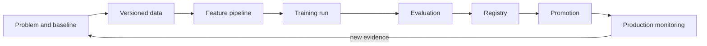
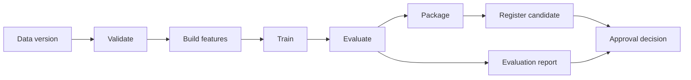

# Chapter 04: ML Lifecycle and Reproducibility

An experiment is evidence, not a deployable system. The ML lifecycle turns a business question into data, code, a model candidate, evaluation results, and an accountable release decision.

## Lifecycle

Start with a measurable decision. “Use machine learning” is not a problem statement. Define the prediction, decision deadline, acceptable errors, current baseline, and owner.

## Problem framing

Write the product decision before selecting an algorithm. Identify the unit of prediction, when the prediction is made, what action consumes it, and when the outcome becomes observable. Define the cost of false positives, false negatives, delayed decisions, and abstention.

A useful baseline can be a rule, historical average, or existing human process. A model that beats no baseline has not demonstrated value. Record constraints such as explainability, privacy, serving latency, update frequency, and regional processing.

## Data and feature lifecycle

Data collection needs an owner, lawful purpose, quality contract, retention rule, and lineage. A dataset version should resolve to immutable files or table snapshots plus the query and code used to construct them.

Feature definitions need consistent semantics across training and serving. Batch-computed features can use a warehouse or lakehouse. Low-latency features may need an online store. If both exist, test that values agree for the same entity and event time.

Prevent leakage by asking whether each feature was available at prediction time. Use event timestamps rather than processing timestamps when reconstructing historical training examples. Fit imputers, scalers, encoders, and vocabulary only on training data.

## Training and validation strategy

Random splits are valid only when observations are independent and identically distributed. Use time-based splits for forecasting and changing populations. Use grouped splits when several records belong to one person, device, customer, or document.

Cross-validation estimates variability across splits. It does not correct a biased sampling process. Keep a final test set outside hyperparameter selection. For rare or high-impact cases, create explicit evaluation slices rather than relying on aggregate metrics.

Match metrics to the decision. Precision and recall expose different classification costs. Ranking systems need ranking metrics. Probabilistic decisions need calibration. Regression needs error distribution and tail analysis, not only a mean.

## Reproducibility bundle

A training run should record:

- source commit and environment image;
- dataset and feature revisions;
- code and configuration;
- random seeds and library versions;
- parameters and metrics;
- produced artifacts; and
- hardware or accelerator details when they affect results.

Experiment tracking helps compare runs. A model registry manages candidates and promotion state. They solve different problems and should not be collapsed into one vague “MLOps tool.”

## Experiment tracking

Organize runs under a stable experiment question. Log parameters, metrics, artifacts, tags, and parent-child relationships for tuning jobs. Store environment and data identity automatically so researchers do not depend on memory.

Do not log every temporary value. Track inputs needed to reproduce the run and outputs needed to compare or investigate it. Large artifacts belong in durable artifact storage; the tracker can hold references and metadata.

Use a model registry to manage candidate identity, validation evidence, ownership, and lifecycle. Prefer explicit aliases such as `candidate`, `canary`, and `production` backed by immutable versions. Changing an alias is a release event and must be audited.

## Reproducible pipeline design

Make stages explicit: data validation, feature generation, training, evaluation, packaging, and registration. Each stage consumes versioned inputs and produces versioned outputs. Cache a stage only when the cache key covers every behavior-changing input.

Pipeline orchestration should record state and retry safe steps. A failed training job can usually retry from validated data. A registration or promotion step needs idempotency to avoid duplicate versions or conflicting aliases.

## Data contracts

Validate schema, ranges, null behavior, categories, freshness, and volume before training. Split data according to the real prediction setting. A random split is misleading for temporal data, grouped entities, or leakage-prone features.

Version metadata in Git and large artifacts in object storage or an artifact system. Content hashes make identity explicit. Data access must preserve privacy and retention rules.

## Metadata and lineage

Lineage connects source records, transformations, features, training runs, models, evaluations, and deployments. It supports impact analysis: when a source table is corrected, teams can identify affected models and releases.

Metadata needs stable identifiers and ownership. Free-form run names help humans but should not be the only linkage. Capture lineage in the pipeline rather than asking engineers to document it after the run.

## Promotion evidence

A promotion report compares the candidate with the current production model and baseline. Include overall and slice metrics, uncertainty, operational requirements, known limitations, data changes, explainability evidence where needed, and reviewer decisions.

Separate technical registration from production approval. A model can be stored in the registry without being safe or valuable to deploy. High-risk systems may require independent review by domain, data, security, or governance owners.

## Continuous training

Retraining can run on a schedule, new-data threshold, drift signal, or performance signal. Triggering training is not the same as approving deployment. Every candidate must pass current evaluation and policy gates.

Keep the previous reproducible release and test rollback. If labels arrive slowly, use proxy signals for early warning but do not pretend they prove outcome quality.

## Evaluation

Choose metrics based on decision cost. Accuracy can hide minority-class failure. Include a baseline, slice metrics, calibration where relevant, operational limits, and a clear promotion threshold. Separate the test set used for final comparison from data used during iteration.

## Failure modes

- The label is available only after the decision point
- Training and serving use different feature definitions
- A notebook run cannot be reconstructed
- A better aggregate metric hides harm to an important slice
- Registry approval is a manual click with no attached evidence

## Checkpoint

Design a training run manifest and promotion report for a churn model. Include data lineage, environment identity, slice metrics, comparison with the current model, and an approval owner.

Completion means another engineer can reproduce the candidate and explain why it should or should not be promoted.
