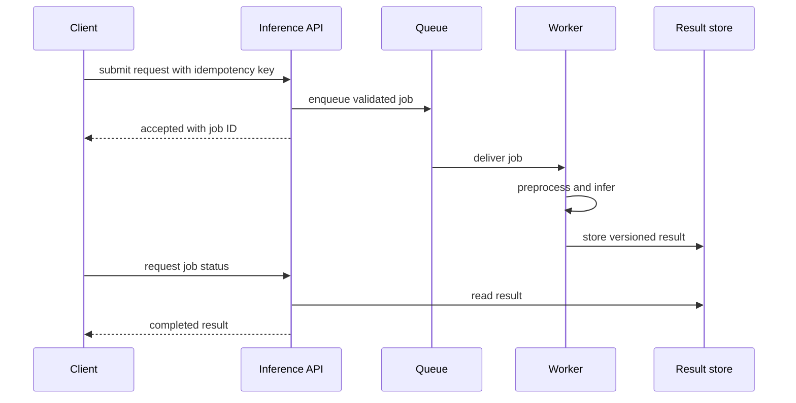
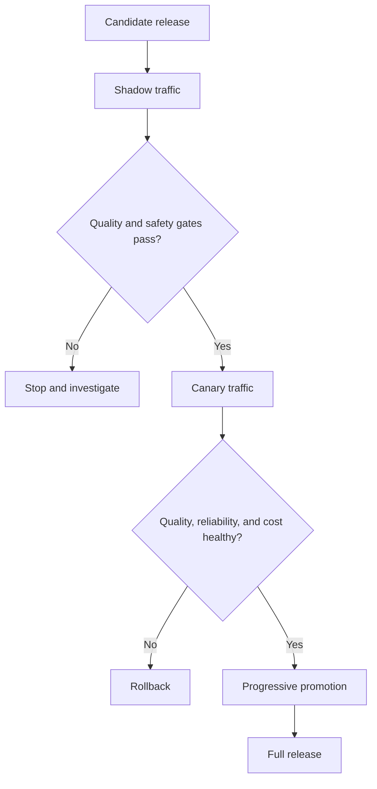

# Chapter 05: Model Delivery and Monitoring

Model delivery connects offline evidence to online behavior. The serving design must match latency, throughput, freshness, and consistency requirements.

## Serving modes

| Mode | Use when | Main risk |
|---|---|---|
| Batch | Decisions tolerate delay and operate on large sets | Stale outputs and failed partial runs |
| Synchronous online | A user or service needs an immediate result | Tail latency and overload |
| Asynchronous online | Work is slow, bursty, or retryable | Queue delay and duplicate processing |
| Streaming | Decisions react continuously to events | Ordering, state, and backpressure |

Package preprocessing, model execution, and postprocessing behind one versioned inference contract. Load models during startup, expose readiness only after loading, and keep health checks independent from expensive inference.

## Serialization and packaging

Serialization formats trade portability, performance, and execution risk. A framework-native checkpoint may require the original class and library versions. A graph format can improve portability but may not support every operation. General object serialization can execute code during loading and must never be treated as safe merely because the file has a model extension.

A model package should identify the model artifact, runtime image, preprocessing, input and output schema, dependencies, hardware requirements, and validation evidence. Test the package in a clean environment before registration.

## Inference API design

Define request size, accepted types, missing-value behavior, batch limits, timeout, and error model. Include a request identifier and model revision in the response metadata. Keep internal confidence or raw logits out of public contracts unless their meaning is calibrated and documented.

Synchronous endpoints should reject work they cannot finish within the latency budget. Asynchronous endpoints return a job identifier and define status, cancellation, expiry, duplicate submission, and result retention. Batch jobs need checkpointing and a clear policy for partial failure.

## Feature consistency

For online inference, compute features from event-time-correct sources and reuse the same definitions as training. When an online feature store is used, monitor freshness, missing values, and offline-online skew. Attach feature-set revision to prediction records.

Batch inference should snapshot source data and output location. Rerunning the same job must not create conflicting results. Partition outputs by model revision and scoring time.

## Promotion strategy

Offline metrics are necessary but insufficient. Use shadow traffic to observe behavior without affecting decisions. Use canaries to expose a controlled fraction of real traffic. Use A/B tests only when assignment, sample size, and success metrics are valid.

Automated rollback needs a trustworthy signal and a compatible previous release. For subtle quality regressions, pause promotion and require review rather than pretending latency alerts can detect everything.

### Blue-green and canary releases

Blue-green deployment keeps old and new environments available while traffic switches. It simplifies rapid reversal but doubles some capacity and does not expose the candidate gradually.

A canary sends controlled traffic to the candidate. Assignment must be stable when users make repeated requests. Compare equivalent traffic slices and guard against a canary receiving only low-risk requests.

### Shadow and A/B evaluation

Shadow traffic copies requests to a candidate without using its response. Remove or transform sensitive fields according to policy and prevent shadow execution from causing tool or database side effects.

A/B testing measures product outcomes under randomized assignment. It is not a replacement for safety and correctness gates. Define hypothesis, primary metric, guardrail metrics, sample size, and stopping rule before the experiment.

### Rollback scope

Rollback must cover model, application, preprocessing, prompt, retrieval index, feature definitions, and configuration. Schema migrations need backward compatibility or an explicit forward-recovery design. Test rollback under load.

## Monitoring layers

Monitor four layers:

1. service health: availability, errors, saturation, and latency;
2. input health: schema, missing values, drift, and freshness;
3. prediction health: distribution, confidence, and slice behavior; and
4. outcome health: delayed labels, business value, and harmful errors.

Data drift means inputs changed. Concept drift means the relationship between inputs and outcomes changed. Neither automatically proves the model is worse. Retraining should be triggered by evidence and policy, not every distribution alert.

## Drift and degradation analysis

Compare production distributions with an appropriate reference window. Segment by region, device, product, and other meaningful slices. Account for seasonality and known campaigns before paging on drift.

Concept drift requires outcomes or a trusted proxy. Investigate label delay, feedback selection bias, and changes in downstream policy. Explainability methods can help diagnose feature behavior but do not prove causality.

Set warning and action thresholds from historical variability and business impact. A threshold without an owner and response is dashboard decoration.

## Feedback and lineage

Log a privacy-safe prediction record with request ID, model revision, feature revision, timestamp, and eventual outcome reference. Preserve enough lineage to investigate while minimizing sensitive data.

Join outcomes back to predictions through stable identifiers. Record corrections, overrides, and abstentions. Feedback captured only from users who complain will be biased, so combine explicit feedback with sampled review and outcome data.

## Reliability and scaling

Protect inference with admission control, bounded queues, per-tenant quotas, timeouts, and circuit breakers. Autoscale on demand signals that match the bottleneck. Include model load time and cache warm-up in readiness.

Batching improves throughput but adds waiting time. Dynamic batching should cap both batch size and maximum delay. Separate workload classes when long jobs block interactive requests.

Use load tests with real input shapes and concurrency distributions. Average latency hides tail behavior. Report time spent waiting, preprocessing, model execution, postprocessing, and network transfer.

## Failure modes

- Online preprocessing differs from training
- retries create duplicate side effects
- a canary receives only easy traffic
- monitoring waits for labels that arrive weeks later
- automatic retraining promotes a weaker model

## Checkpoint

Design an online model release with shadow validation, canary promotion, rollback criteria, and delayed outcome monitoring. State which signals can automate a decision and which require human review.

Completion means deployment, quality, and rollback are one controlled process rather than separate scripts.
