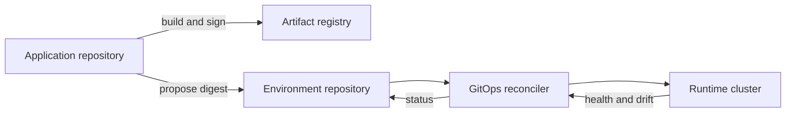

# Chapter 06: Infrastructure, GitOps, and Internal Platforms

Infrastructure as code makes desired state reviewable and repeatable. GitOps makes deployment intent convergent. An internal developer platform turns these mechanisms into a usable product.

## Infrastructure contracts

Build small modules around stable capabilities: a service runtime, model endpoint, queue, vector store, or training environment. Pin providers, review plans, store state remotely with locking, and separate credentials from configuration.

Do not use workspaces as the only isolation boundary for environments with different risk. Separate accounts, projects, subscriptions, or clusters provide clearer blast-radius control. Avoid provisioners for routine configuration; they hide imperative actions inside a declarative workflow.

## Terraform operating model

Providers translate configuration into remote API operations. Pin provider versions and review upgrades because schema or behavior changes can alter a plan. Keep provider configuration near the composition root rather than hiding it inside reusable modules.

State maps declared resources to remote objects and may contain sensitive values. Store it in a protected remote backend with encryption, locking, versioning, and recovery. Restrict direct state access. Never resolve concurrent changes by manually deleting a lock without confirming that no operation is running.

Build modules around a supported capability, not a thin wrapper over every provider argument. A model-serving module can create identity, network policy, logging, budgets, and runtime resources together. Version modules, document compatibility, and test representative compositions.

Separate root configurations by environment or ownership boundary. Pass values explicitly, expose only useful outputs, and avoid circular dependencies. Use data sources carefully because they can create hidden runtime coupling to mutable external resources.

The safe workflow is format and validate, run policy and security checks, produce a saved plan, review it in the target environment, then apply that exact plan through automation. Detect drift on a schedule and route unexpected changes to an owner.

## GitOps reconciliation

CI builds and verifies artifacts. It updates deployment intent by immutable digest. A reconciler pulls that intent into the cluster and reports drift. CI should not hold broad cluster credentials.

Use Helm for reusable packages and Kustomize for overlays when those fit the team's operating model. Do not combine templating layers until nobody can predict the rendered manifest.

## GitOps repository design

Separate application source from environment intent when different permissions and promotion flows apply. Store immutable artifact identifiers, environment configuration, and policy-relevant metadata in the intent repository.

Organize by ownership and blast radius. A single global directory can make every change depend on one review queue. Too many repositories can hide system-wide impact. Choose the boundary that matches access, reconciliation, and incident ownership.

Automated synchronization is appropriate when validation and rollback are strong. Production promotion can still require an approved change. Self-healing should revert unauthorized drift, but responders need an audited break-glass path for emergencies.

Secrets do not belong in plain Git. Use encrypted secret workflows or references to an external secret manager. Key rotation and repository history must be part of the design.

## Packaging deployment configuration

Helm provides parameterized packages and release operations. Keep values small and intentional. Validate rendered output and avoid logic that turns templates into an unreadable programming language.

Kustomize composes bases and overlays through structured patches. Keep a base deployable and overlays focused on environmental differences. If an overlay replaces most of the base, it is no longer sharing a useful abstraction.

Policy checks should run against rendered manifests, not only templates. The deployed object is the security and operational reality.

## Platform as a product

A golden path should generate a repository, pipeline, ownership metadata, runtime configuration, observability, and security defaults. It should expose a platform API so automation is not tied to one portal.

The service catalog records ownership, lifecycle, dependencies, documentation, and operational links. Keep catalog metadata close to the service and validate it automatically. An inventory with stale owners is harmful during incidents.

Scaffolding should create a working first deployment, not only boilerplate. A template can collect service name, owner, data class, runtime profile, and SLO tier, then create the repository and submit reviewed infrastructure changes.

Version templates and provide migration support. Regenerating a repository over local modifications is unsafe. Shared workflow components and modules allow standards to evolve without replacing every file.

Policy as code enforces non-negotiable constraints: trusted registries, resource limits, approved regions, ownership labels, encryption, and restricted privileges. Pair every rejection with a useful reason and a supported remediation path.

Measure time to first successful deployment, adoption, change failure rate, support demand, and developer satisfaction. High adoption caused by a mandate is not proof of usability.

## Platform API design

Model platform capabilities as resources with stable schemas and lifecycle states. A request for an inference service should declare desired capacity, data classification, model source, owner, and service tier. The platform resolves provider-specific resources behind that contract.

Operations should be idempotent and asynchronous where provisioning is slow. Expose status, conditions, failure reasons, and observed generation. Users need to know whether the platform accepted the request, started reconciliation, or reached readiness.

Plan deprecation from the beginning. Publish supported versions, migration paths, deadlines, and telemetry showing remaining consumers.

## Policy and governance

Apply policy at pull request, admission, and continuous audit stages. Early feedback is cheaper; admission prevents unsafe state; audit catches drift and resources outside the normal path.

Policies should have identifiers, owners, rationale, test cases, severity, and exception process. Test both allowed and denied examples. Emergency exceptions need scope, expiry, approval, and retrospective review.

## Platform team topology

The platform team owns the product and its reliability. Enabling teams may help consumers adopt new capabilities. Complicated subsystems such as GPU scheduling or identity can have specialist owners while remaining accessible through platform contracts.

Publish a responsibility matrix. The platform can operate the shared runtime while a product team owns its data quality, evaluation, and on-call response for domain failures.

## Measuring developer experience

Combine telemetry with interviews. Measure time spent waiting, failed attempts, documentation search, support handoffs, and successful self-service. Segment by new and experienced users because a path can be efficient after setup but painful to discover.

Track where teams leave the golden path. Repeated exceptions indicate a missing capability or an overly rigid abstraction. Review platform cost against saved engineering time and reduced incident risk.

## Failure modes

- Modules expose every provider option and create no standard
- Git says healthy while the service fails user requests
- self-service creates resources without owners or budgets
- policy blocks emergencies with no audited break-glass path
- the platform team becomes a ticket queue behind a portal

## Checkpoint

Design a golden path for a model-serving API. Include repository scaffolding, identity, infrastructure, delivery, observability, policy, cost ownership, and an escape-hatch process.

Completion means a product team can ship safely without direct platform-team intervention.
