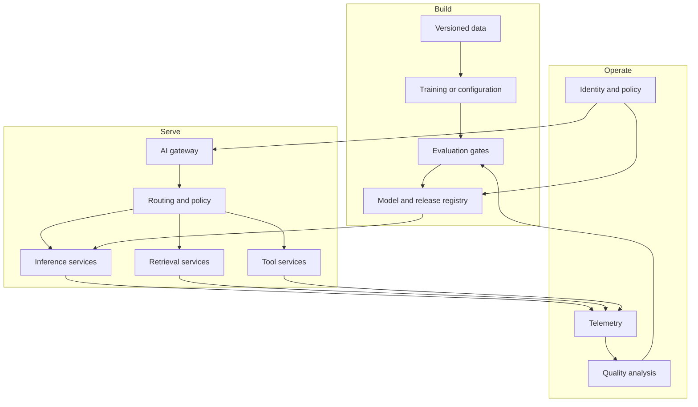

# Chapter 07: AI Platform Architecture

An AI platform connects data movement, model development, runtime serving, application delivery, and evidence. Architecture should make those boundaries explicit.

## Reference flow

## Architectural decisions

Separate control-plane state from request-path data. A registry outage should not stop an already deployed model from serving. A telemetry outage should degrade diagnostics, not corrupt responses.

Choose synchronous calls only when the caller must wait. Use queues for long-running, bursty, or retryable work. Make consumers idempotent and carry correlation IDs across boundaries.

Use an API gateway for authentication and coarse traffic policy. Use an AI gateway for model-specific routing, quotas, usage, provider abstraction, and safety controls. They may run in one product, but the responsibilities remain distinct.

Multi-environment design includes separate data access, keys, quotas, and evaluation expectations. Copying production data into development is not environment parity; it is a privacy failure.

## Architecture layers

The experience layer contains product interfaces and workflow integrations. The application layer owns domain rules, sessions, orchestration, and response composition. The AI capability layer provides model access, retrieval, tools, evaluation, and safety controls. The platform layer supplies identity, delivery, compute, storage, and telemetry.

Keep these layers replaceable through explicit contracts. A product should not import infrastructure provisioning code, and the platform should not encode one product's conversation flow.

## Training and serving paths

Training is throughput-oriented and can tolerate queued batch execution. Online serving is latency-oriented and must limit work before overload. Separate their capacity pools and credentials even when they share artifacts.

The model registry is a control-plane dependency. Deployment resolves a model version into a local or managed runtime. Request handling should not query the registry for every inference.

Data pipelines need clear ownership for ingestion, validation, transformation, feature generation, indexing, and deletion. Event-driven pipelines reduce polling but require idempotency, ordering policy, replay, and dead-letter handling.

## Gateway and routing design

Authenticate users at the application edge and propagate a verified identity or delegated scope. The AI gateway applies model allowlists, tenant quotas, request limits, routing, usage collection, and provider policy.

Routing can consider capability, modality, context length, region, latency, quality tier, and budget. Keep the decision observable. A fallback must remain within the user's data policy and the product's minimum quality threshold.

Use rate limits to prevent abuse and admission control to protect constrained backends. Per-tenant limits prevent one workload from consuming shared capacity. Global limits protect provider quota and infrastructure.

## Multi-tenancy

Isolation has several dimensions:

- identity and authorization;
- data storage and encryption keys;
- network paths;
- compute, queues, and quotas;
- caches and model context;
- logs, traces, and analytics; and
- cost attribution.

Shared infrastructure improves utilization but increases the need for strong logical isolation. Dedicated resources reduce some cross-tenant risk at higher cost and operating complexity. Choose per risk class instead of applying one model to every tenant.

Cache keys must include tenant, authorization context, model, prompt, tools, and freshness where these affect results. Never reuse retrieved context across tenants through a shared semantic cache without equivalent authorization.

## Reliability model

Identify critical dependencies and define timeouts, retry budgets, circuit breakers, fallbacks, and load shedding. A fallback model may be faster but less capable; disclose or restrict it when behavior changes materially.

Cache only where identity, freshness, and authorization permit. Prompt-response caching can leak information across users if tenant and policy context are missing from the key.

## Resilience patterns

Set dependency timeouts from the end-to-end latency budget. Retry only transient failures and cap total attempts. Add jitter so clients do not retry together. Use circuit breakers to stop sending traffic to a failing dependency and bulkheads to isolate pools.

Queues absorb bursts but do not create infinite capacity. Bound queue size and age, expose waiting time, and reject work when completing it within the service objective is impossible.

Define recovery objectives for stateful components. Replication supports availability; backups support recovery from deletion, corruption, and some security incidents. Test restoration and regional failover.

## Deployment units

Split services when they require different scaling, permissions, release cadence, or ownership. Avoid turning every function into a network service. Each service adds latency, failure modes, deployment work, and on-call surface.

Model serving, retrieval, and tool execution often deserve separate boundaries because their resource and security profiles differ. Orchestration can remain within the application until independent scaling or durable execution requires separation.

## Architecture review

Review the system through scenarios rather than a component inventory. Trace a normal request, an unauthorized request, provider timeout, stale index, overloaded GPU pool, unsafe tool call, data deletion request, and rollback.

For each scenario, identify the decision point, state mutation, evidence, owner, and user-visible behavior. Record unresolved risks with an owner and deadline.

## Performance model

Break latency into edge, queue, orchestration, retrieval, model, tool, and validation time. Size throughput from arrival rate, service time, concurrency, and headroom. Measure prompt and output length distributions because averages hide expensive tails.

Cost models should include provider tokens, accelerator time, idle capacity, storage, network transfer, vector indexing, telemetry, and engineering operations. Attribute cost per successful task as well as per request.

## Failure modes

- Every request depends on the registry or experiment tracker
- retries at several layers amplify one failure
- a shared gateway becomes a global bottleneck
- provider abstraction hides capabilities needed for quality
- no team owns end-to-end latency or cost

## Checkpoint

Create a multi-environment architecture for a RAG assistant. Mark trust boundaries, synchronous and asynchronous paths, data residency, deployment units, failure containment, and telemetry.

Completion means every dependency has an owner, timeout, failure behavior, and recovery path.
