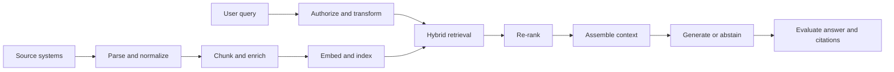

# Chapter 09: Retrieval Engineering

Retrieval-augmented generation gives a model selected evidence at request time. It is useful when knowledge changes, must be scoped by authorization, or needs citations.

## Retrieval pipeline

Parsing quality often matters more than vector-store choice. Preserve headings, tables, page references, timestamps, and access metadata. Chunk around semantic units and test several sizes against representative questions.

## Ingestion and index lifecycle

Connectors should checkpoint progress, retry safe reads, and preserve source identifiers. Normalize encoding and document structure without discarding evidence needed for citation. Extract tables and images through modality-aware paths instead of flattening everything into broken text.

Assign each source revision a content hash. Upsert changed chunks and remove chunks for deleted or revoked documents. A production index needs freshness objectives, reconciliation, backfill, and disaster recovery.

Store metadata for source, revision, section, position, language, timestamp, tenant, classification, and access policy. Keep large original content in durable object storage when the retrieval store is not the system of record.

## Chunking

Fixed-size chunks are simple but can split semantic units. Recursive splitting respects headings and paragraphs before falling back to smaller boundaries. Parent-child indexing retrieves a precise child and returns a larger parent context.

Overlap can preserve boundary information but increases storage and duplicate retrieval. Code, tables, transcripts, and legal clauses need different segmentation. Evaluate chunking as a retrieval parameter, not a formatting preference.

## Embeddings and similarity

An embedding model maps content into a vector space. The index and query must use compatible models and preprocessing. Changing embedding models requires re-embedding or a versioned parallel index.

Cosine similarity compares direction, dot product combines direction and magnitude, and Euclidean distance measures geometric separation. Use the metric expected by the embedding model and index.

Approximate nearest-neighbor indexes trade exactness for speed and memory. Graph-based indexes and inverted-file families expose build-time and query-time parameters. Benchmark recall, latency, memory, build time, and update behavior with production-shaped data.

## Retrieval design

Dense retrieval captures semantic similarity. Sparse retrieval handles exact terms, identifiers, and rare names. Hybrid retrieval combines both, then re-ranking spends more compute on a small candidate set.

Normalize or rank-fuse dense and sparse scores because their numeric scales differ. Metadata filters narrow eligible content before scoring. Query rewriting can expand acronyms or reformulate conversational questions, but preserve the original query for audit and fallback.

A cross-encoder or model-based re-ranker scores query-document pairs more precisely at higher cost. Limit it to a candidate set and measure whether the quality gain justifies latency.

Apply authorization before content enters model context. Post-filtering after retrieval can reduce recall and risks handling unauthorized text. Include tenant, document policy, and freshness in the retrieval contract.

Context assembly must balance relevance, diversity, ordering, and token budget. Deduplicate overlapping chunks. Prefer direct evidence over many weak matches. If evidence is absent or conflicting, the system should say so.

Place source identifiers next to content in a machine-readable envelope. Clearly delimit retrieved text from trusted instructions. Retrieved documents can contain malicious instructions and must be treated as data.

Citation generation should map claims to exact source spans. A citation is not valid because the document discusses the same topic. Evaluate whether the cited span supports the claim.

## Vector store selection

Evaluate stores by filtering, update and deletion behavior, index types, consistency, backup, tenancy, regional deployment, observability, and operating model. A library index embedded in one process fits experiments and small local systems. A distributed service fits shared scale but adds network and operational cost.

Test the expected corpus size and query concurrency. Vendor benchmark numbers rarely reflect your metadata filters, vector dimensions, update rate, and tenancy pattern.

## Advanced patterns

Parent-child retrieval returns a small matching unit with broader context. Query decomposition helps multi-part questions. Graph retrieval helps relationship-heavy domains. Agentic retrieval can choose tools dynamically, but it adds latency and unpredictable control flow. Add it only after a deterministic pipeline reaches its limit.

Context compression removes irrelevant portions after retrieval. It can improve token efficiency but may delete qualifiers. Recursive retrieval follows references or summaries across levels. Graph retrieval traverses entities and relations when connections matter more than isolated similarity.

Multimodal retrieval can index shared image-text embeddings or coordinate modality-specific stores. Preserve page, region, timestamp, and media evidence for review.

## Evaluation

Measure retrieval recall, ranking quality, answer correctness, groundedness, citation precision, latency, and cost. Separate retrieval failure from generation failure. Build the evaluation set from real questions and known evidence.

Label answerable and unanswerable cases. For retrieval, record relevant source identifiers and compute whether they appear in the candidate and final context. For generation, evaluate claim support, completeness, citation mapping, and abstention.

Slice by query type, language, document age, tenant, and access policy. Track ingestion freshness and deletion compliance separately from answer quality. Online feedback can reveal gaps but is biased toward users who choose to respond.

## Operations

Monitor connector lag, parse failures, chunk counts, embedding errors, index size, update latency, query latency, filter selectivity, empty retrieval, and source distribution. Attach index and embedding revisions to traces.

Use blue-green indexes for large re-embedding changes. Validate the candidate index, shift controlled traffic, and retain the previous version until rollback risk passes.

## Failure modes

- documents are indexed without deletion or update handling
- chunks lose source and authorization metadata
- citation markers do not support the generated claim
- evaluation uses synthetic questions that are easier than production traffic
- the system answers confidently when retrieval finds nothing

## Checkpoint

Build a retrieval design for policy documents with hybrid search, re-ranking, access filtering, citations, freshness, and deletion. Define evaluation cases for ambiguous, unanswerable, and conflicting questions.

Completion means every answer can be traced to authorized evidence or explicitly abstains.
