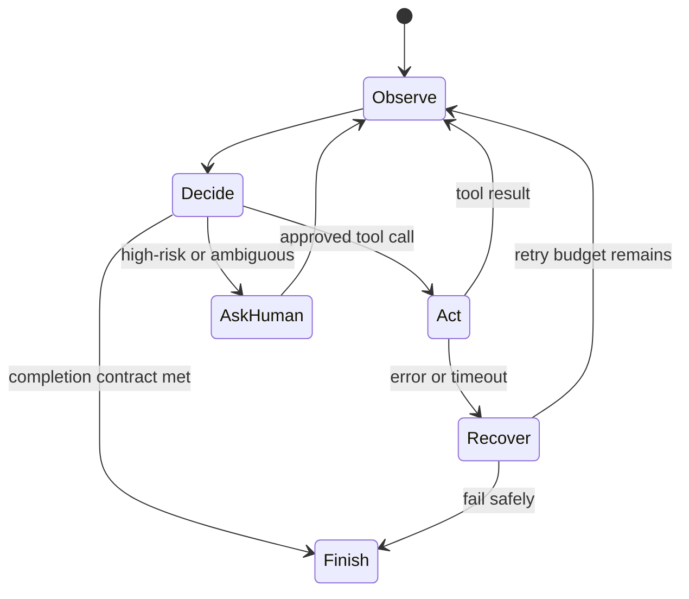

# Chapter 10: Agentic Systems

An agent is a model-driven control loop that can select actions based on changing state. Use it when the next step cannot be fully decided in advance. Use a workflow when the steps are known.

## Control loop

The runtime, not the model, enforces the maximum steps, time budget, cost budget, allowed tools, and approval policy.

## Agent versus workflow

A deterministic workflow defines transitions in code. A model may classify or generate inside a step, but it does not choose the overall path. An agent allows the model to select the next action from an approved set.

Start with a workflow when the process is known, regulated, or side-effect-heavy. Add agentic choice only where runtime ambiguity makes fixed branching impractical. Hybrid systems keep approvals and state transitions deterministic while allowing model choice inside bounded stages.

An agent needs:

- an objective and completion contract;
- current state and relevant context;
- a bounded set of tools;
- a policy and permission scope;
- budgets for steps, time, tokens, and money;
- durable checkpoints; and
- terminal states for success, failure, cancellation, and escalation.

## Planning

A plan is a proposed sequence, not authorization. Validate that referenced tools exist, dependencies are plausible, and the plan fits budget. Replan when observations invalidate assumptions, but cap replanning to prevent loops.

For short tasks, selecting the next action can be more reliable than producing a long plan that becomes stale. For complex tasks, represent steps as structured state with dependencies and completion criteria.

## Patterns

- Router: select one specialist path from a bounded set.
- Planner-executor: create a plan, then validate each execution step.
- Supervisor: coordinate workers through explicit tasks and results.
- Reflection: critique an artifact against criteria, with a strict iteration cap.
- Human approval: stop before irreversible or high-impact actions.

Multi-agent systems add communication failure, duplicated context, inconsistent state, and cost. Split agents only when roles need different permissions, context, ownership, or independent scaling. Several prompts in one process do not automatically form a useful architecture.

### Router

A router selects one path using a bounded label set. Validate the label and define a safe default. Evaluate routing accuracy separately from downstream quality.

### Planner and executor

The planner proposes structured tasks. The executor performs only validated tasks. This separation supports permissions and review but can fail when the planner lacks real execution feedback.

### Supervisor and workers

A supervisor delegates tasks and aggregates results. Give workers narrow roles and explicit result schemas. Prevent recursive delegation unless the runtime tracks depth and budget.

### Reflection

Reflection compares an artifact against a rubric and proposes revision. It is useful when criteria are observable. Iteration without a rubric often produces stylistic churn and higher cost.

### Debate and voting

Multiple generations can expose alternatives but are correlated when they share the same model and context. Voting can amplify a common error. Use independent evidence or tools when correctness matters.

## Framework selection

Agent frameworks can provide graph execution, durable state, tool adapters, tracing, and human approval. Evaluate them by execution semantics, persistence, retry behavior, cancellation, deployment model, observability, and escape hatches.

Do not choose from a feature count. Implement one representative workflow, inject failures, inspect stored state, and test upgrades. Keep domain tools and schemas independent from framework-specific objects.

## State and durability

Persist workflow state outside the model context. Record tool calls, results, approvals, budgets, and terminal reason. Use idempotency keys for side-effecting tools. A durable execution engine is often more important than an agent framework.

Checkpoint before and after side effects. On resume, determine whether the action completed instead of blindly repeating it. Use an outbox, transaction record, or downstream idempotency key when atomic execution is unavailable.

Separate observed facts from model-generated notes. Store provenance and trust level. Summaries help fit context but should not overwrite authoritative records.

## Human control

Human-in-the-loop is a state in the workflow, not a chat message asking for confirmation. Present the proposed action, target, evidence, expected effect, and alternatives. Bind approval to the exact action payload and expire it when state changes.

Route ambiguous, high-impact, low-confidence, or policy-required cases to a qualified reviewer. Provide a cancel and correction path. Measure review load because excessive approval requests can cause rubber-stamping.

## Tool execution safety

Resolve identity and authorization outside the model. Validate arguments, restrict destinations, sandbox code, limit output size, and mark tool content as untrusted. Separate read and write tools so read-only tasks cannot escalate accidentally.

Retries require error classification. Retry transient reads automatically. For writes, confirm status or use idempotency. Compensating actions may reverse some effects, but they are not equivalent to transactions.

## Evaluation

Evaluate task completion, tool selection, argument validity, policy compliance, number of steps, recovery behavior, latency, and cost. Test adversarial tool output and incomplete state. The final prose can be good while the action history is unsafe.

Use trajectory evaluation to inspect ordered decisions, not only the final answer. Record unnecessary calls, repeated calls, invalid transitions, unsupported assumptions, and missed escalation. Replay fixed tool results to compare orchestration versions deterministically.

In production, monitor loop length, terminal reason, tool error rate, approval rate, cancellation, queue age, and cost per completed task. Sample complete traces for qualitative review under privacy controls.

## Failure modes

- the agent loops until budget exhaustion
- a planner invents unavailable tools
- retries repeat a payment or deletion
- workers share more data than their role permits
- human approval is requested after the side effect

## Checkpoint

Design an incident-investigation agent that can query telemetry but cannot deploy or change infrastructure. Add step, time, and cost budgets, durable state, tool scopes, and an escalation rule.

Completion means the agent can be interrupted, resumed, audited, and stopped without relying on model cooperation.
