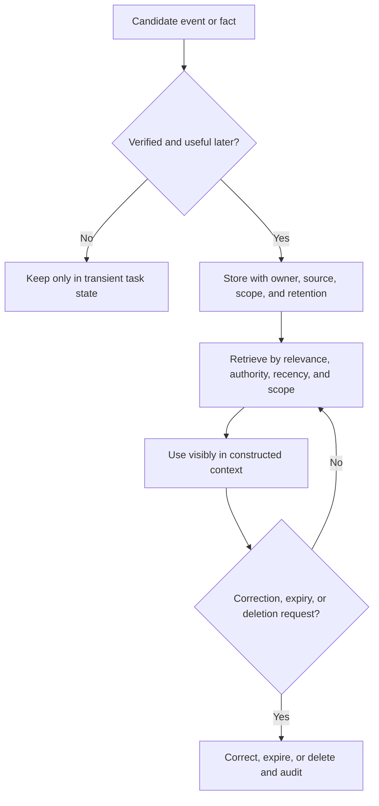
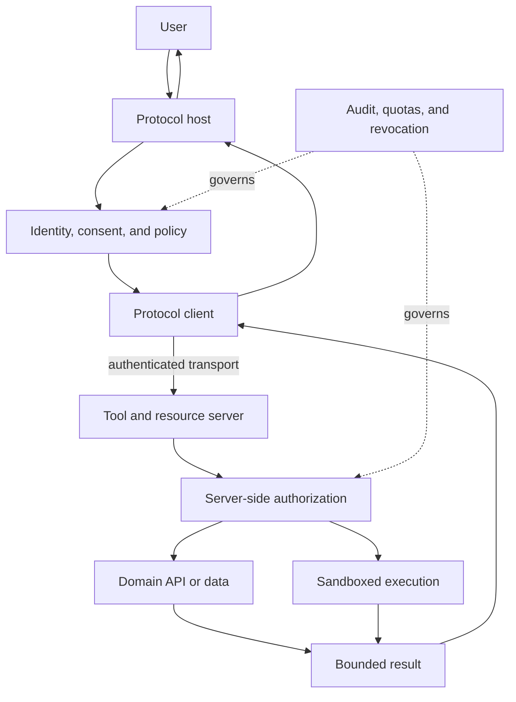
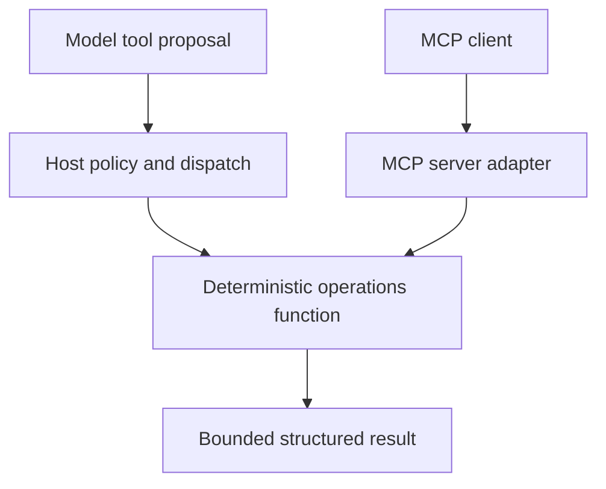

# Chapter 11: Context, Tools, and Protocols

Tools are APIs for model-driven callers. Memory is stored state selected for future use. Protocols standardize how clients discover and invoke capabilities. None of them removes the need for authorization.

## Tool contract

A reliable tool has one responsibility, a precise name, a small typed input, a bounded output, explicit errors, and idempotency behavior. Descriptions should state when to use the tool and when not to use it.

Validate model-generated arguments exactly as untrusted API input. Resolve identity in the runtime. Never let the model select an arbitrary tenant, permission scope, file path, or network destination.

## Designing tool schemas

Use descriptive names and one clear operation per tool. Prefer domain parameters such as `order_id` and `reason_code` over generic query strings. Mark required fields, constrain lengths and enumerations, and reject unknown fields when silent acceptance is dangerous.

Return structured data with a status, stable identifiers, bounded content, and typed error. Avoid dumping entire database rows or documents into context. Paginate or summarize large results and provide a follow-up tool for details.

Separate discovery from execution. A search tool can return candidate records; a write tool acts on one validated identifier. This creates an authorization and approval boundary.

## Execution controls

The tool runtime should bind the caller's verified identity and allowed scope. The model may request an action but cannot grant itself access. Apply network egress restrictions, path allowlists, query limits, statement timeouts, and sandboxing according to tool type.

Use idempotency keys for actions that may retry. Record request, validated arguments, identity, policy decision, result, and downstream reference. Redact sensitive values from traces while preserving evidence needed for investigation.

Treat tool descriptions and results as possible injection channels. A web page, ticket, document, or database field can contain instructions aimed at the model. Delimit tool data and prevent it from changing runtime policy.

Classify tools by impact:

| Class | Example | Control |
|---|---|---|
| Read-only | Search documentation | scoped access and output filtering |
| Reversible | Create a draft ticket | idempotency and audit trail |
| Sensitive | Query customer records | least privilege and purpose checks |
| Irreversible | Transfer funds or delete data | explicit approval and strong confirmation |

## Guided build, part 1: execute a typed tool call

Build a small operations assistant that can inspect a fixed service catalog. Keep the capability deterministic; the model chooses whether to request the tool, while Python validates and executes it.

Create `operations.py`:

```python
from typing import Literal

ServiceName = Literal["catalog-api", "retrieval-api", "model-gateway"]

SERVICES = {
    "catalog-api": {"status": "healthy", "latency_ms": 42},
    "retrieval-api": {"status": "degraded", "latency_ms": 680},
    "model-gateway": {"status": "healthy", "latency_ms": 210},
}


def get_service_status(service_name: ServiceName) -> dict[str, str | int]:
    """Return bounded learning data for one known service."""
    service = SERVICES.get(service_name)
    if service is None:
        return {"status": "error", "message": "unknown service"}
    return {"service": service_name, **service}
```

Create `tool_calling.py`. The schema presented to the model and the runtime dispatch allowlist are separate controls:

```python
import json
import os

from openai import OpenAI

from operations import get_service_status

TOOLS = [
    {
        "type": "function",
        "function": {
            "name": "get_service_status",
            "description": "Read current status for one service in the learning catalog.",
            "parameters": {
                "type": "object",
                "properties": {
                    "service_name": {
                        "type": "string",
                        "enum": ["catalog-api", "retrieval-api", "model-gateway"],
                    }
                },
                "required": ["service_name"],
                "additionalProperties": False,
            },
        },
    }
]

DISPATCH = {"get_service_status": get_service_status}

options = {"api_key": os.environ["MODEL_API_KEY"]}
if base_url := os.getenv("MODEL_BASE_URL"):
    options["base_url"] = base_url
client = OpenAI(**options)

messages = [
    {
        "role": "user",
        "content": "Check retrieval-api and summarize whether it needs attention.",
    }
]

response = client.chat.completions.create(
    model=os.environ["MODEL_NAME"],
    messages=messages,
    tools=TOOLS,
)
assistant_message = response.choices[0].message
messages.append(assistant_message)

for call in assistant_message.tool_calls or []:
    function = DISPATCH.get(call.function.name)
    if function is None:
        result = {"status": "error", "message": "tool is not allowed"}
    else:
        try:
            arguments = json.loads(call.function.arguments)
            result = function(**arguments)
        except (json.JSONDecodeError, TypeError) as error:
            result = {"status": "error", "message": type(error).__name__}

    messages.append(
        {
            "role": "tool",
            "tool_call_id": call.id,
            "content": json.dumps(result),
        }
    )

final = client.chat.completions.create(
    model=os.environ["MODEL_NAME"],
    messages=messages,
    tools=TOOLS,
)
print(final.choices[0].message.content)
```

Use the SDK environment from the Generative AI Systems chapter and run `python tool_calling.py`. Inspect the first response before executing it: the model emits a proposal containing a tool name and arguments; the runtime decides whether that proposal is allowed.

Change the prompt so it asks for an unknown service and then for an undeclared action such as restarting a service. The runtime must not invent a dispatch target. If you later add a write tool, collect approval in the host application and pass that verified decision outside the model-generated arguments. An `approved: true` value chosen by the model is not approval.

## Memory model

Conversation state supports the current interaction. Episodic memory records past events. Semantic memory stores durable facts. Procedural memory stores policies or learned operating instructions. Keep these stores separate because retention, trust, and update rules differ.

Summarization saves context but can erase constraints. Store source records and treat summaries as derived data. Retrieve memory by relevance, recency, authority, and user scope. Give users a way to inspect and delete durable personal memory.

## Memory lifecycle

Write memory only when the information has future value, a lawful retention basis, and a clear subject. A model-generated claim should not become a durable user fact without verification.

Each memory record needs owner, scope, source, timestamp, confidence or authority, retention, and deletion behavior. Namespace memory by user and tenant. Encrypt sensitive stores and restrict support access.

Retrieval should combine semantic relevance with filters for scope, recency, and trust. Resolve conflicts by authority and freshness rather than embedding similarity alone. Make memory use visible where it affects user expectations.

Compression can summarize old conversations or consolidate duplicate facts. Keep links to originals, mark the summary as derived, and revalidate important constraints before action.



## Context construction

Build context from ordered sections with explicit provenance: policy, task state, retrieved evidence, memory, tool definitions, and user input. Reserve budget for tool results and output. Remove stale or redundant messages instead of truncating blindly.

Context is not durable workflow state. Persist checkpoints, approvals, and external identifiers in a database or workflow engine. Reconstruct model context from that state when execution resumes.

## Protocol boundary

A context and tool protocol can expose resources, prompts, and tools through a consistent client-server interface. The protocol handles discovery and invocation shape. The host application still owns consent, authentication, authorization, sandboxing, and display of tool activity.

Prefer local process transport for tightly controlled local integrations and authenticated remote transport for shared services. Do not expose a general shell or filesystem when a narrow domain tool will work.

## Protocol architecture

A protocol host coordinates the user experience and security policy. A client maintains a connection to a server. The server exposes declared capabilities such as tools, resources, and reusable prompts. Capability negotiation lets peers agree on supported features.

Local standard-input/output transport is simple and keeps a server under the host process boundary. Streamable HTTP supports remote operation and streaming responses. Remote servers need authenticated connections, origin validation, session handling, timeouts, and protection from cross-network request attacks.

Resources expose addressable context such as documents or schema. Tools perform computation or actions. Prompts provide reusable interaction templates. Do not use a prompt when the requirement is a deterministic policy or executable operation.



## Guided build, part 2: expose the capability through MCP

Tool calling lets a model propose a function invocation. MCP lets hosts discover and invoke capabilities through a shared protocol. Reuse the same deterministic domain function rather than duplicating its logic inside the protocol adapter.

Install the official Python SDK v2 with its development tools, then commit the resolved dependency version because the v1 and v2 server APIs differ:

```bash
python -m pip install 'mcp[cli]'
```

Create `mcp_server.py`:

```python
from typing import Literal

from mcp.server import MCPServer

from operations import get_service_status as lookup_service_status

mcp = MCPServer("operations-learning-server")


@mcp.tool()
def get_service_status(
    service_name: Literal["catalog-api", "retrieval-api", "model-gateway"],
) -> dict[str, str | int]:
    """Read current status for one service in the learning catalog."""
    return lookup_service_status(service_name)
```

Open the server in the MCP Inspector:

```bash
mcp dev mcp_server.py
```

Inspect the generated schema, invoke `get_service_status`, and confirm that an unknown value is rejected before the function runs. The Inspector proves protocol discovery and invocation; it does not prove that an LLM chose the right tool.

Next, run the server over Streamable HTTP:

```bash
mcp run mcp_server.py --transport streamable-http
```

Create a minimal protocol client in `mcp_client.py`:

```python
import asyncio

from mcp import Client


async def main() -> None:
    async with Client("http://localhost:8000/mcp") as client:
        tools = await client.list_tools()
        print([tool.name for tool in tools.tools])

        result = await client.call_tool(
            "get_service_status",
            {"service_name": "retrieval-api"},
        )
        print(result.structured_content)


asyncio.run(main())
```

Run `python mcp_client.py` in a second terminal. Capture three pieces of evidence: discovered tool name, generated input schema, and structured result. Then stop the HTTP server and repeat the original local function test. The domain capability should remain usable without MCP.

The completed project has three distinct layers:



Tool calling and MCP converge on the same capability, but they solve different problems. The host owns model interaction, user consent, and approval. The MCP server owns capability contracts and server-side enforcement.

## Authentication and authorization

Authentication proves the client or user identity. Authorization decides whether that identity can invoke a capability on a target. For remote tool servers, support short-lived tokens and delegated user scopes rather than one shared server key.

The host should display the server identity, requested capabilities, and high-impact actions. Enterprise deployments need allowlists, version governance, inventory, audit, and revocation.

Server-side checks remain mandatory even when the host filters tools. A compromised or outdated client must not bypass access controls.

## Compatibility and operations

Version schemas deliberately. Additive optional fields are easier to adopt than renamed meanings. Test old clients against new servers and reject unsupported protocol versions clearly.

Monitor connection failures, discovery latency, tool calls, error classes, payload size, authorization denial, and server revision. Apply quotas per tenant and capability. A shared protocol does not imply shared reliability or trust.

## Code execution and filesystem tools

Code execution needs an isolated environment with resource, time, process, filesystem, and network limits. Destroy the environment after use unless persistence is an explicit product feature. Never mount host credentials or broad workspace paths by default.

Filesystem tools should expose narrow roots, canonicalize paths, reject traversal, and distinguish read from write. Prefer domain operations such as “read report” or “save draft” over arbitrary shell access.

## Failure modes

- tool output contains prompt injection and is treated as trusted instruction
- broad credentials are shared across all tools
- memory crosses users or environments
- a renamed schema breaks older clients silently
- the tool reports success before an asynchronous action completes

## Checkpoint

Specify a tool server for a support agent with order lookup and refund-draft tools. Include schemas, identity propagation, scopes, approval, idempotency, audit records, and untrusted-output handling.

Completion means tool power is bounded by code and policy, not by prompt wording.
