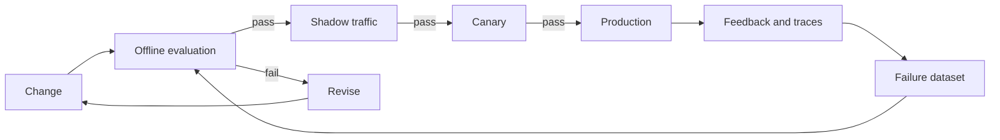

# Chapter 12: LLMOps and Evaluation

LLMOps manages the changing combination of models, prompts, retrieval, tools, policies, and evaluation evidence. A release is trustworthy only when the complete combination is tested.

## Evaluation stack

Use several layers:

1. deterministic checks for schemas, citations, forbidden actions, and tool arguments;
2. reference-based metrics where a correct target exists;
3. rubric-based model judging for qualities that need interpretation;
4. expert review for high-risk or ambiguous cases; and
5. online outcome and feedback monitoring.

Model judges are measurement tools, not ground truth. Calibrate them against human labels, randomize presentation order, track disagreement, and version the judge model and rubric.

## Evaluation dataset design

Start with the product task and known failure costs. Include ordinary cases, boundary conditions, important user groups, multiple languages where supported, adversarial input, unanswerable questions, dependency failures, and policy-sensitive actions.

Each case should contain stable input, expected properties, relevant evidence, tags, and provenance. Exact reference answers fit deterministic tasks. Rubrics fit open-ended tasks. Tool workflows need expected state transitions and allowed side effects.

Keep a fixed regression set for comparability and a challenge set that grows from incidents and new requirements. Deduplicate against training, prompt examples, and retrieved test documents to reduce leakage.

## Metrics and uncertainty

Report pass rate and severity-weighted failures, not one blended score. Slice results by task, risk, tenant class, language, document type, and other meaningful dimensions.

Small score differences may be noise. Use paired comparisons because candidates run on the same cases. Report sample size and confidence where decisions depend on close results. For human review, measure agreement and adjudicate ambiguous rubrics.

Deterministic checks should block invalid schema, unsupported citations, prohibited content, budget violations, and unsafe tool arguments. Model-based grading can assess relevance, completeness, tone, or groundedness when calibrated.

## Release loop

Keep a fixed regression set and a growing challenge set. Prevent test leakage into prompts, retrieval sources, or training data. Report aggregate and slice results with confidence intervals where sample size matters.

## Version and release management

Treat the application image, model revision, prompt bundle, retrieval index, tool schema, policy bundle, and evaluation set as one release composition. Store their immutable identifiers in a manifest.

Every prompt change goes through review and regression evaluation. Separate prompt content from runtime secrets and environment configuration. Record who approved a release and the exact evidence presented.

Use shadow traffic to compare behavior without affecting users. Use a canary for controlled exposure. Define rollback thresholds before release and include quality, safety, latency, error, and cost guardrails.

## Failure analysis

Classify failures by stage: input understanding, routing, retrieval, context assembly, model generation, schema validation, tool selection, tool execution, policy, or presentation. A single “bad answer” category cannot guide engineering work.

Cluster recurring failures, inspect representative traces, and create minimal reproducible cases. Decide whether the fix belongs in data, prompt, retrieval, tool schema, model selection, orchestration, or product UX.

## Observability

Trace model calls, retrieval, tools, validation, retries, and user-visible outcomes. Record versions and timing at each span. Redact or tokenize sensitive fields before export. Sample routine traffic while retaining errors and policy events according to retention rules.

Standard trace attributes should include operation, provider, model, input and output token counts, finish reason, request class, release, and error type. Add retrieval count and scores, tool name and status, and evaluation identifiers where appropriate.

Do not use high-cardinality generated text as metric labels. Store request-level detail in protected traces and aggregate bounded dimensions into metrics.

Dashboards should connect user outcomes with system stages. A quality drop alongside stable model behavior may come from stale retrieval. A latency spike may come from queueing rather than generation.

## Guardrails and validation

Apply input classification, data-loss prevention, content policy, schema validation, grounding checks, and action authorization according to risk. Guardrails can fail open or closed; define behavior explicitly for each control.

Measure false positives and false negatives. A guardrail that blocks legitimate use can destroy product value. A model-based guardrail also needs versioning and evaluation.

## Cost and latency

Measure cost per successful task. Break latency into queueing, retrieval, model time, tool time, and validation. Optimize the dominant component. Smaller models, caching, shorter context, batching, and routing all trade against quality or freshness and require evaluation.

Set budgets per request, tenant, product, and environment. Track input, output, cached, embedding, reranking, tool, storage, and accelerator costs. Alert on unit-cost change rather than only total spend.

Optimize in evidence-backed order: remove unnecessary context, reduce repeated calls, cache safe stable work, batch compatible jobs, route simple tasks, then consider model or infrastructure changes. Re-run quality evaluation after every optimization.

Latency optimization follows the critical path. Parallelize independent retrieval or tools, stream user-visible output, warm model replicas, and set bounded timeouts. Parallel calls can increase provider pressure and cost, so cap concurrency.

## Online evaluation

Use task completion, correction, escalation, user abandonment, and downstream outcome where available. Explicit ratings are useful but biased. Sample interactions for expert review under privacy rules.

Connect online events to release and evaluation versions. Detect distribution change and add representative failures to the challenge set. Do not train directly on raw feedback without consent, filtering, and quality control.

## Failure modes

- prompts change without regression tests
- one score hides critical safety failures
- evaluators reward style over factual correctness
- traces collect sensitive content indefinitely
- a cheaper route causes more escalations and retries

## Checkpoint

Create an evaluation plan for a support assistant. Include a dataset schema, rubrics, deterministic checks, slice analysis, release thresholds, online signals, and rollback ownership.

Completion means every production change has comparable evidence and every serious failure becomes a future test.
