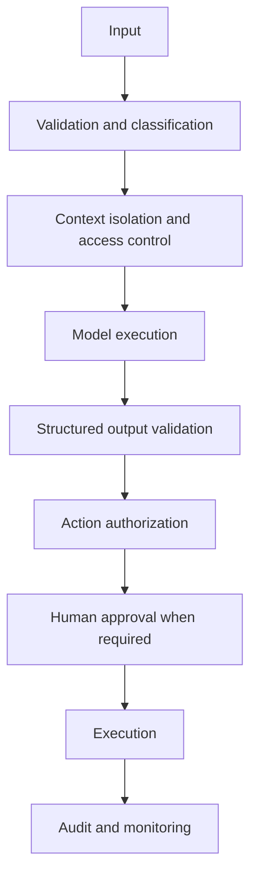

# Chapter 13: AI Security and Governance

AI security extends application security. It adds untrusted natural-language instructions, probabilistic output, retrieval data, model artifacts, and tools that can act.

## Threat model

Map assets, actors, trust boundaries, entry points, and consequences. Include:

- system instructions and model credentials;
- training, evaluation, and retrieval data;
- model weights, adapters, and artifact registries;
- user prompts, uploaded files, and tool output;
- agent identities and downstream APIs; and
- traces, feedback, and audit evidence.

Prompt injection is an authorization problem as much as a model problem. Assume untrusted content can influence model output. Keep permissions outside the prompt, constrain tools, validate actions, and require approval for high-impact operations.

## AI attack surface

Direct prompt injection comes from the user. Indirect injection arrives through documents, web pages, tool results, or memory. Jailbreaks attempt to bypass behavioral controls. Excessive agency turns a model mistake into a real action because permissions or approvals are too broad.

Other risks include sensitive-data disclosure, poisoned training or retrieval data, insecure model and plugin supply chains, denial of service through expensive inputs, cross-tenant leakage, unsafe output handling, and overreliance on plausible responses.

Map each risk to a concrete asset and consequence. “The model may hallucinate” is too vague. “The assistant may invent a refund authorization code that the order service accepts” identifies a boundary to fix.

## Secure development lifecycle

Classify the use case and data before implementation. Define allowed models, providers, regions, tools, retention, and human oversight. Threat-model the data flow and complete abuse cases alongside user stories.

During build, scan dependencies and model artifacts, validate schemas, test access controls, and keep evaluation data separate. Before release, run adversarial evaluation and verify monitoring, rollback, and incident ownership. After release, monitor policy events and review changes in models, data, and threats.

## Identity and zero trust

Authenticate every user and workload. Authorize each data access and tool action with the current identity and purpose. Use short-lived credentials, network segmentation, encrypted transport, and explicit service identities.

Do not trust an internal network location, a model-generated claim, or a prior tool call. Re-evaluate authorization at the resource boundary. Propagate only the scope needed by the downstream action.

## Layered controls

No content filter covers the full threat surface. Combine identity, authorization, isolation, data minimization, egress control, sandboxing, output validation, and incident response.

Container and workload controls include non-root execution, restricted capabilities, read-only filesystems, trusted images, admission policy, runtime isolation, and network egress limits. Code execution requires stronger sandbox boundaries and disposable environments.

Protect the AI supply chain with pinned artifacts, provenance, signatures, restricted registries, dependency review, and controlled deserialization. Record base model, adapter, tokenizer, prompt, and policy identity in the release.

## Governance system

Maintain an inventory of AI use cases, owners, models, data sources, intended users, risk class, evaluation evidence, and review dates. Use model cards and system cards to document intended use and limitations. Preserve lineage from policy to control to evidence.

Organize governance as a lifecycle: govern responsibilities, map context and impact, measure risks and performance, then manage prioritized risks. Link every requirement to an implemented control, evidence source, owner, and review frequency.

High-risk use cases need stronger approval, independent review, monitoring, and human recourse. Low-risk systems still need inventory, ownership, and baseline security. Risk tiering should change controls, not become a paperwork label.

Explainability must fit the audience and decision. Feature importance, retrieved citations, tool history, or a concise rationale answer different questions. Do not claim that a generated explanation reveals the model's true internal cause.

Privacy controls include purpose limitation, retention, deletion, residency, and subject rights. Do not send sensitive data to a provider because a prompt says “keep this confidential.” Enforce provider and region policy in the gateway.

## Red teaming

Test direct and indirect prompt injection, excessive agency, data leakage, cross-tenant access, malicious files, insecure tool arguments, denial of service, and supply-chain compromise. Automate repeatable cases and use human exploration for novel combinations. Treat findings as engineering defects with owners and regression tests.

Red-team environments need safe test accounts, synthetic or approved data, rate limits, and clear stop conditions. Preserve prompts, tool traces, versions, and outcomes. Rank findings by feasible impact rather than novelty.

## AI incident response

Prepare for data disclosure, unsafe action, poisoned source, compromised model artifact, provider behavior change, and widespread quality regression. Runbooks should cover containment, credential and artifact revocation, index rebuild, model or prompt rollback, customer communication, evidence preservation, and regulatory escalation.

Model output may be ephemeral, so retain privacy-safe evidence needed to reconstruct serious events. After the incident, add regression cases and update controls. Do not close an AI incident with a prompt edit when the root cause is missing authorization.

## Audit and privacy

Audit records should show actor, action, target, policy decision, release, time, and outcome. Protect audit stores from alteration and restrict their sensitive content.

Apply data minimization to prompts, retrieval, memory, logs, and feedback. Define deletion propagation across indexes, caches, traces, and training candidates. Provider retention settings do not replace the application's own lifecycle controls.

## Failure modes

- a safety prompt substitutes for access control
- logs become a second ungoverned copy of sensitive data
- policy documents have no technical enforcement point
- red-team findings are not added to regression suites
- emergency access has no expiry or audit trail

## Checkpoint

Threat-model a tool-using RAG assistant. Rank risks by likelihood and impact, map each to preventive and detective controls, and define incident evidence.

Completion means every critical action is authorized outside the model and every high-risk system has a named owner and review path.
