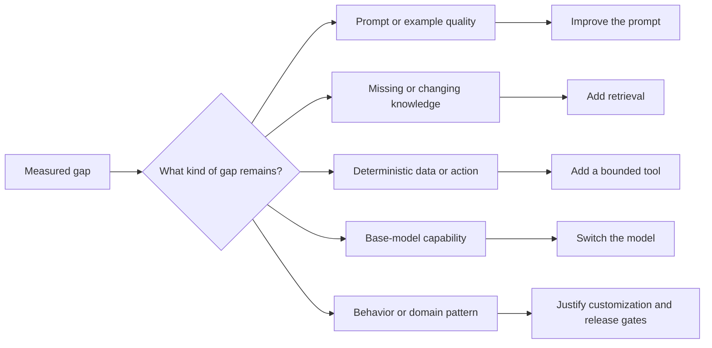
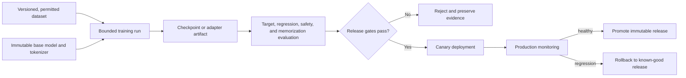

# Chapter 15: Model Customization

Customize a model only after simpler controls fail. Better instructions, retrieval, tools, output constraints, or a different base model are cheaper to iterate and easier to reverse.

## Decision order

1. Define an evaluation set and baseline.
2. Improve the task contract and prompt.
3. Add retrieval for changing or private knowledge.
4. Add tools for deterministic actions or data access.
5. Try a more suitable base model.
6. Fine-tune when the remaining gap is behavioral, stylistic, structural, or domain-pattern related.

Fine-tuning is weak at storing facts that change frequently. It can improve consistent format, task behavior, terminology, and performance of a smaller model on a narrow distribution.

## Transfer and instruction tuning

Transfer learning starts from a pretrained model and adapts it to a target distribution. Full fine-tuning updates all model parameters and requires substantial memory and compute. Instruction tuning trains on input-response examples so the model follows a task pattern.

Domain adaptation can continue training on domain text or supervised examples. Continued pretraining changes language and knowledge patterns but can damage general capability if data and optimization are poor. Measure out-of-domain regression.

## Dataset engineering

Define a schema for instructions, context, response, metadata, and provenance. Validate encoding and token length. Remove secrets, prohibited personal data, duplicates, contradictory labels, generated boilerplate, and examples without clear rights.

Balance task types and difficult cases. Thousands of clean representative examples can outperform a larger noisy dataset. Inspect length and label distributions and reserve sources or time periods for evaluation.

Human annotation needs written guidelines, training, disagreement measurement, and adjudication. Synthetic data can expand coverage but should be filtered and evaluated against human-authored cases. Do not let one model generate both training data and the only evaluator.

## Data pipeline

Curate examples for correctness, diversity, permission, and representation. Remove duplicates and leakage. Split by source or time when random splitting would place near-identical samples across train and evaluation sets. Version the dataset and document exclusions.

Supervised fine-tuning learns from demonstrations. Preference methods learn from ranked alternatives. Parameter-efficient methods update a small set of adapter parameters. Low-rank adaptation reduces trainable parameters; quantized variants reduce base-model memory further. Efficiency does not remove the need for quality and safety evaluation.

### LoRA and QLoRA

LoRA inserts low-rank trainable matrices into selected layers while freezing base weights. Rank, target modules, scaling, dropout, and learning rate affect quality and size. QLoRA keeps the base model quantized during adapter training to reduce memory.

Adapters preserve a shared base and can support several tasks. They introduce compatibility and routing requirements. Record the exact base revision, tokenizer, adapter configuration, and merge state.

### Other parameter-efficient methods

Prefix and prompt tuning learn virtual tokens. Adapter layers add small trainable modules. Gating-based methods scale selected internal activations. Hardware and library support varies, so benchmark operational complexity alongside training cost.

### Quantization

Low-bit weights reduce memory. Training-time and serving-time quantization are different decisions. Evaluate task quality, calibration method, kernel support, throughput, and device portability. Quantizing an adapter stack may behave differently from quantizing a merged model.

## Training and release

Track base model revision, tokenizer, dataset, code, hyperparameters, seed, hardware, checkpoints, and metrics. Evaluate during training, but keep a held-out release set. Compare against the base model and the current production system, including safety and regressions outside the target task.

Package adapters with explicit compatibility metadata. Merging adapters simplifies serving but creates a new artifact that needs full provenance and evaluation.

## Training operations

Estimate memory for weights, gradients, optimizer state, activations, and temporary buffers. Use gradient accumulation when a full effective batch does not fit. Mixed precision reduces memory and can increase throughput, but monitor numerical instability.

Track training and validation loss, task metrics, learning rate, gradient norms, throughput, and hardware errors. Save checkpoints according to recovery cost and storage budget. Early stopping needs a representative validation signal.

Hyperparameter search should have a bounded budget and a declared objective. Record failed trials. Selecting the best of many noisy evaluations can overfit the validation set.

## Preference optimization

Preference data contains a prompt and relative judgments among responses. Reward-model-based training separates preference modeling from policy optimization. Direct preference methods optimize the policy from pairs without a separate reward model.

Both approaches inherit annotator and sampling bias. Include ties or uncertainty where the method permits, analyze disagreement, and test for reward hacking and verbosity preference. Safety alignment is broader than refusing keywords; it includes calibrated assistance and secure runtime controls.

## Evaluation and deployment

Compare the customized model against the untouched base, the current production system, and simpler prompt or retrieval changes. Evaluate target behavior, general capability, safety, memorization, latency, throughput, and cost.

Run contamination checks and canary deployment. Monitor changes in input distribution and user corrections. Keep base and adapter artifacts immutable and retain a known-good rollback release.

For multi-adapter serving, isolate tenant and task routing, cap loaded adapters, and measure swap or merge latency. An incorrect adapter is a cross-domain data and quality incident.

## Alignment limits

Human preference data reflects annotator instructions, population, and context. Reward or preference optimization can exploit weaknesses in the measurement. Use diverse review, disagreement analysis, and adversarial tests. Alignment training does not create hard authorization boundaries.

## Failure modes

- training data contains evaluation answers
- a model improves style while factual quality falls
- licensing or consent for data is unclear
- adapter and base-model revisions are incompatible
- a customized model has no rollback path

## Checkpoint

Write a customization decision record for a domain assistant. Show the baseline gap, why retrieval and prompting are insufficient, data rights, method choice, release gates, serving cost, and rollback.

Completion means fine-tuning is justified by measured value rather than novelty.
