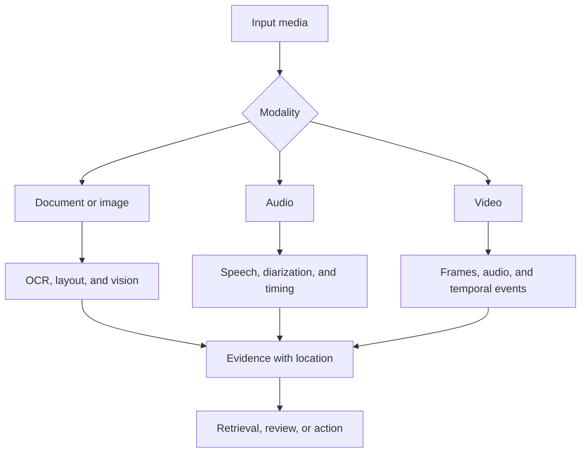

# Chapter 16: Multimodal Platforms

Multimodal systems process text, images, audio, or video through different pipelines and combine their evidence. The hard part is usually ingestion, timing, storage, evaluation, and rights management.

## Media pipeline

Validate media type from content, not only file extension. Scan untrusted files, limit size and duration, strip unsafe metadata where appropriate, and process in an isolated worker. Use asynchronous jobs for expensive media operations.

## Ingestion and normalization

Store the original object under an immutable identifier and record checksum, owner, consent, classification, and retention. Generate derived assets such as page images, audio segments, frames, thumbnails, and transcripts with lineage back to the original.

Normalize orientation, color space, sample rate, channel layout, codec, and container only when the task requires it. Preserve the original because conversions are lossy. Split large media into deterministic segments with overlap where boundary context matters.

Use a job state machine for upload, quarantine, extraction, inference, review, and publication. Idempotency prevents duplicate expensive processing when events retry.

## Modality decisions

OCR converts document pixels into text and layout. Vision encoders capture image semantics. Object detection locates entities. Speech recognition maps audio to timed text. Speaker diarization separates speakers; speaker recognition identifies a person and carries higher privacy risk. Video understanding requires sampling and temporal reasoning, not only independent frame captions.

Preserve timestamps, bounding boxes, page numbers, and confidence so downstream answers can point back to evidence. Multimodal retrieval may combine separate indexes or a shared embedding space. Test whether the representation supports the actual query types.

### Vision and documents

Image classification assigns labels to an image. Object detection locates instances. Segmentation assigns regions. Vision-language models connect visual and textual reasoning. OCR needs text recognition plus layout when reading forms, tables, or multi-column pages.

Document systems should retain reading order, headings, cells, page geometry, signatures, and handwritten uncertainty. Route low-confidence or high-impact fields to review instead of silently filling them.

Diffusion and other image-generation systems require prompt and output policy, provenance, rights handling, and abuse controls. Generated media should not enter a trusted evidence store without clear labeling.

### Audio

Speech recognition outputs text and timing. Diarization separates speakers. Speaker identification or voice cloning introduces biometric and impersonation risk and needs explicit authorization.

Noise reduction and voice activity detection can improve processing but may remove quiet speech. Evaluate accents, languages, overlapping speakers, domain terms, and low-quality devices.

### Video

Video combines frames, audio, subtitles, and temporal events. Uniform frame sampling can miss brief actions. Use shot detection, task-aware sampling, and audio alignment. Preserve timestamps for every extracted claim.

Video generation and transformation are compute-heavy and create safety, provenance, and rights concerns. Process asynchronously with quotas and review based on use case.

## Streaming

Real-time audio or video needs bounded buffers, backpressure, partial results, cancellation, and end-of-stream handling. Measure end-to-end delay, not model inference alone. Decide how revisions to partial transcripts or detections affect consumers.

Use sequence numbers and event time to handle delayed chunks. Mark partial output as provisional. Downstream systems must not trigger irreversible action from a transcript segment that the recognizer may revise.

When the processor falls behind, choose whether to drop frames, reduce quality, increase latency, or stop the stream. The product requirement decides which degradation is safe.

## Multimodal retrieval and assistants

Index textual transcripts and OCR together with visual or audio embeddings. A query may search one modality and return another. Re-ranking should consider both semantic relevance and exact evidence location.

For multimodal RAG, assemble a bounded set of text spans, image regions, or media segments. Ensure the selected model supports the modality and size. Cite pages, boxes, or timestamps in the response.

An assistant that can create media, inspect documents, and call tools needs separate permissions for each capability. Media content remains untrusted input and can contain indirect instructions.

## Evaluation

Evaluate each extraction stage and the final task. Include noisy audio, accents, small text, rotated pages, charts, long video, and missing channels. Human review is necessary where perceptual ambiguity or harm is high.

Measure OCR character or word error, field extraction accuracy, detection precision and recall, transcription error, speaker assignment, temporal localization, retrieval recall, and end-task success as appropriate. Aggregate scores can hide poor performance for one language, device, or visual condition.

Maintain golden media with rights for repeated testing. Large media tests are expensive, so use a small smoke set on every change and a broader scheduled or release suite.

## Operations and cost

Monitor upload failure, quarantine rejection, processing queue age, segment count, model latency, accelerator use, storage growth, review rate, and deletion completion. Derived media multiplies storage, so apply lifecycle policies to originals and intermediates deliberately.

Cache deterministic extraction by content hash and model revision. Do not reuse derived data after the source loses authorization or reaches retention expiry.

## Failure modes

- extracted text loses its page or visual relationship
- a model infers sensitive attributes that the product does not need
- partial streaming output triggers irreversible work
- copyrighted or biometric media has unclear rights
- storage cost grows because raw and derived media have no lifecycle policy

## Checkpoint

Design a document-and-meeting assistant. Include upload validation, OCR, transcription, timestamps, retrieval, user permissions, retention, quality evaluation, and human review.

Completion means every generated statement can be linked to a specific permitted media segment.
