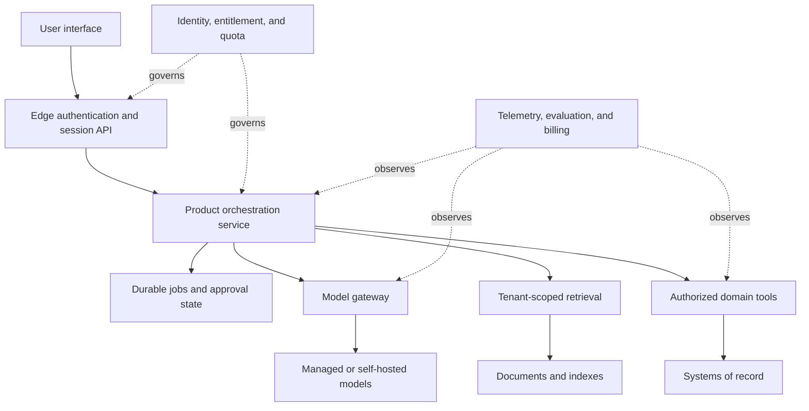
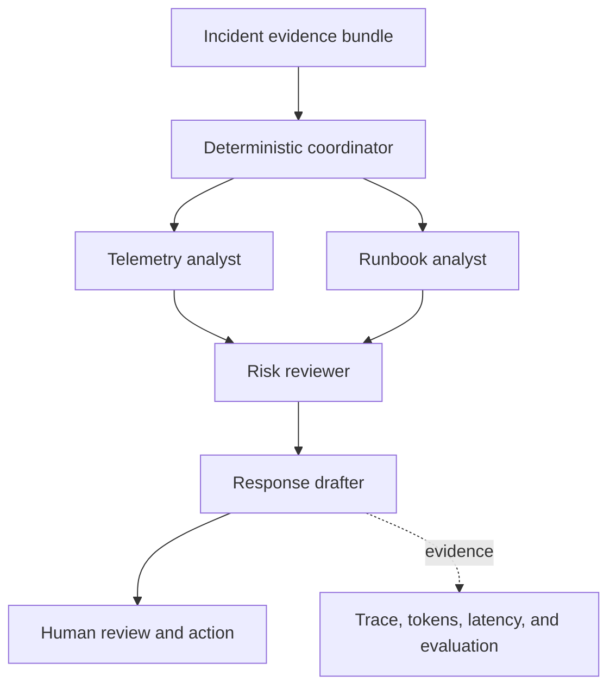
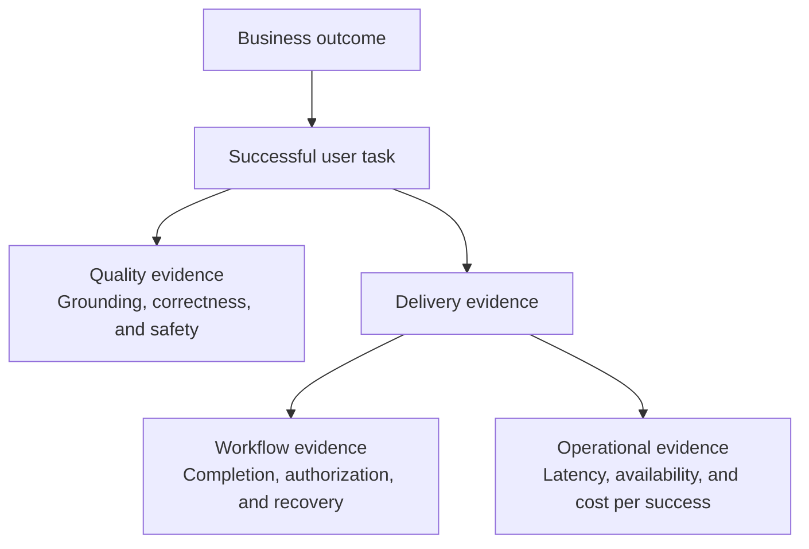

# Chapter 17: AI Product Engineering

An AI capability becomes a product when users can understand it, recover from failure, control their data, and receive consistent value at sustainable cost.

## Product contract

Define the user decision or task, the acceptable failure, and what the interface will do when uncertain. Show sources and tool activity when they help users verify behavior. Make corrections easy. Do not present probabilistic output as a guaranteed fact.

Use progressive disclosure: give a useful result first, then evidence and detail. Keep users in control of consequential actions. Confirmation should state the exact action and target, not ask a vague “Are you sure?”

## Product discovery

Start from a repeated user problem with measurable cost. Observe the current workflow, decisions, handoffs, recovery, and existing alternatives. Separate a need for language flexibility from work that rules or search can handle better.

Define the smallest outcome experiment. A concierge test, retrieval prototype, or offline evaluation may answer the risky question before a complete application exists. State what evidence will stop the project.

Requirements include quality, latency, data access, accessibility, supported languages, human oversight, audit, retention, and unit economics. “Accurate AI” is not testable.

## AI interaction design

Set expectations about capability and limits at the point of use. Preserve user input during errors and support cancellation. Show citations when evidence matters and action previews before side effects.

Let users edit drafts, retry with changed constraints, report a specific problem, and reach a human path. When evidence is weak, ask a focused clarification, present alternatives, or abstain.

Accessibility applies to generated content, streaming updates, focus management, images, audio, and error messages. Generated interfaces still need semantic structure and keyboard operation.

## Application architecture

Separate session state, durable user memory, domain records, and telemetry. Authenticate at the edge and authorize every data or tool operation. Use background jobs for long work and publish explicit status. Support cancellation and idempotent retry.

Tenant-aware quotas should cover requests, tokens, tool calls, storage, and accelerator use. Attribute cost to product, tenant, feature, model, and outcome. Rate limits protect the system; budgets protect the business.



## Identity, session, and memory

Authentication establishes the user. Authorization is checked for each record and tool. Session state supports the current task. Durable memory is a separate opt-in capability with inspection, correction, export, and deletion.

Do not place authorization claims only in conversation history. Resolve them from trusted identity and policy services. Expire delegated tool scopes and bind approvals to exact actions.

## Backend and frontend contracts

Use asynchronous jobs for long generation, ingestion, and media processing. Expose queued, running, waiting-for-approval, completed, failed, cancelled, and expired states. Make submission idempotent.

Streaming APIs should distinguish text deltas, structured events, tool status, citations, usage, and terminal errors. The client handles reconnect and partial completion without duplicating actions.

Version public APIs and generated schemas. Keep provider-specific response formats behind backend adapters.

## Multi-tenant product architecture

Isolation covers identity, data, retrieval indexes, caches, model context, tools, telemetry, and billing. Apply quotas and concurrency limits by tenant and plan.

Use an entitlement service for features and limits. Billing meters must be auditable and idempotent. Tokens may drive cost, but customer pricing should map to understandable value such as tasks, seats, documents, or capacity.

## Product patterns

A chatbot supports open-ended conversation. A copilot stays inside a user's workflow and proposes work. A background agent performs bounded asynchronous tasks. Search may be better than chat when users need comparison and navigation.

Choose the interface that fits the task. Do not wrap every backend in a blank chat box.

## Guided workshop: multi-agent incident triage

Build a learning-grade assistant for a real operational task: turning an incident evidence bundle into a safe triage brief. Multiple agents are justified only if their separated responsibilities improve evidence coverage or review quality. They must not become an unstructured group chat.

The coordinator is deterministic. Two specialist calls can run concurrently, the risk review waits for their findings, and the response draft waits for the review. No agent can restart a service or change infrastructure.



Create `incident_workshop.py`. It reuses the OpenAI-compatible SDK configuration from the model-access exercise, so it can run against a hosted provider, Ollama, or vLLM when the selected model supports the required context and instruction following.

```python
import asyncio
import json
import os
from dataclasses import asdict, dataclass
from time import monotonic

from openai import AsyncOpenAI


INCIDENT = {
    "service": "retrieval-api",
    "started_at": "2026-01-15T09:20:00Z",
    "symptoms": {
        "error_rate": "18%",
        "p95_latency_ms": 6800,
        "queue_depth": 940,
    },
    "recent_change": "retriever release 2.4 deployed 17 minutes earlier",
    "trace_sample": "timeouts begin after vector-store query",
    "runbook": [
        "compare the current release with the previous healthy release",
        "check vector-store latency and connection saturation",
        "prepare rollback; require incident-commander approval before execution",
    ],
}


@dataclass(frozen=True)
class AgentResult:
    role: str
    content: str
    latency_ms: int
    input_tokens: int
    output_tokens: int


def create_client() -> AsyncOpenAI:
    options = {"api_key": os.environ["MODEL_API_KEY"]}
    if base_url := os.getenv("MODEL_BASE_URL"):
        options["base_url"] = base_url
    return AsyncOpenAI(**options)


async def run_agent(
    client: AsyncOpenAI,
    role: str,
    instruction: str,
    evidence: dict,
) -> AgentResult:
    started = monotonic()
    response = await client.chat.completions.create(
        model=os.environ["MODEL_NAME"],
        temperature=0,
        messages=[
            {
                "role": "system",
                "content": (
                    f"You are the {role}. {instruction} "
                    "Use only supplied evidence. Mark unknowns. Do not execute actions."
                ),
            },
            {"role": "user", "content": json.dumps(evidence)},
        ],
    )
    usage = response.usage
    return AgentResult(
        role=role,
        content=response.choices[0].message.content or "",
        latency_ms=round((monotonic() - started) * 1_000),
        input_tokens=usage.prompt_tokens if usage else 0,
        output_tokens=usage.completion_tokens if usage else 0,
    )


async def triage() -> list[AgentResult]:
    client = create_client()
    telemetry, runbook = await asyncio.gather(
        run_agent(
            client,
            "telemetry analyst",
            "Identify observed symptoms, likely bottleneck, and missing evidence.",
            INCIDENT,
        ),
        run_agent(
            client,
            "runbook analyst",
            "Map the evidence to relevant runbook steps and approval boundaries.",
            INCIDENT,
        ),
    )

    findings = {
        "incident": INCIDENT,
        "telemetry_findings": telemetry.content,
        "runbook_findings": runbook.content,
    }
    risk = await run_agent(
        client,
        "risk reviewer",
        "Flag unsupported claims and actions requiring human approval.",
        findings,
    )
    draft = await run_agent(
        client,
        "response drafter",
        "Write a concise brief with impact, evidence, unknowns, and proposed next step.",
        {**findings, "risk_review": risk.content},
    )
    await client.close()
    return [telemetry, runbook, risk, draft]


async def main() -> None:
    results = await triage()
    print(json.dumps([asdict(result) for result in results], indent=2))


asyncio.run(main())
```

Run it with the environment variables from the Generative AI Systems chapter:

```bash
python incident_workshop.py > multi-agent-result.json
```

Inspect the result before adding any interface. The draft should distinguish observed facts from hypotheses, preserve the approval boundary around rollback, and avoid inventing customer impact. Total token use is the sum across all four calls; parallel specialists reduce elapsed time but not cost.

### Compare against one agent

Create a baseline that sends the same `INCIDENT` object to one model call with one instruction: produce a safe triage brief with evidence, unknowns, runbook guidance, and approval boundaries. Save its result separately.

Score both designs on the same five criteria:

| Criterion | Test |
|---|---|
| Evidence coverage | Every claim maps to a supplied incident field |
| Unsupported claims | Count facts introduced without evidence |
| Action safety | Rollback remains a proposal requiring human approval |
| Usefulness | The brief identifies impact, unknowns, and next investigation |
| Efficiency | Compare elapsed time and total input/output tokens |

Keep the multi-agent design only if role separation improves a criterion that matters enough to justify extra calls, latency, cost, and failure states. If the single-agent baseline performs equally well, use it.

This workshop intentionally stays inside one process and uses static evidence. Durable execution, live telemetry tools, authentication, and operational actions belong in a later capstone, where their failure and approval states can be designed explicitly.

## Product analytics

Track task completion, correction, escalation, repeat use, latency, quality signals, and cost per successful task. Raw thumbs-up rates are easy to collect and hard to interpret. Connect feedback to request versions and ask targeted questions after meaningful interactions.

Define a metric tree from business outcome to user task, AI quality, and system health. Successful case resolution may depend on answer correctness, tool success, response time, and escalation quality.

Run experiments with guardrail metrics for safety, support load, latency, and cost. Segment new and experienced users. Avoid optimizing engagement when the goal is task completion.



## Cost and capacity

Forecast requests, input and output length, retrieval, tools, storage, and accelerator or provider spend. Include retries, failed tasks, evaluation, observability, and support. Track unit cost per successful task.

Use routing, caching, batching, context reduction, and asynchronous work only after measuring quality trade-offs. Plan quota behavior before launch so overload fails predictably.

## Build or buy

Buy commodity infrastructure when it meets data, latency, reliability, and cost requirements. Build where the capability creates product differentiation or a required control is missing. Count integration, migration, incident response, and exit cost, not only API price.

Evaluate data portability, identity integration, observability, regional availability, limits, pricing changes, and model retirement. Preserve an adapter boundary where switching is plausible, but do not hide useful provider capabilities behind a weak lowest-common-denominator interface.

## Production support

Publish ownership, service objectives, status communication, support access, incident process, and data handling. Give support staff safe diagnostic views without exposing full prompts or tenant data by default.

Deprecate models and features through a measured migration. Inform users when behavior or data processing changes materially. Preserve export and deletion when accounts close.

## Failure modes

- a prototype has no permission or tenancy model
- users cannot tell when the system took an action
- billing meters tokens while customer value comes from completed work
- fallback behavior silently changes quality
- feedback is collected without a process to use it

## Checkpoint

Specify an AI product from user task to production operation. Include UX for uncertainty, tenancy, authentication, session and memory, quotas, billing unit, evaluation, analytics, support, and deletion.

Completion means the product can explain its state, limits, actions, and recovery path to users and operators.
