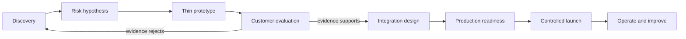

# Chapter 18: Forward-Deployed Engineering

Forward-deployed engineering closes the gap between a reusable platform and a customer's real environment. The work combines discovery, rapid validation, integration, deployment, and communication.

## Discovery before solution

Start with the current workflow, decision owners, pain, constraints, data, systems, and measurable outcome. Ask what happens when the solution is wrong or unavailable. Separate stated requirements from assumptions that need evidence.

Produce a scope with in-scope users, integrations, data classes, latency and reliability targets, evaluation criteria, rollout boundary, and explicit exclusions. A proof of concept tests the riskiest assumption; it is not a rushed production system.

## Discovery practice

Interview operators, domain experts, security, data owners, and decision makers. Ask for a recent real example and walk through it from trigger to outcome. Observe workarounds, waiting, re-entry, and exceptions.

Quantify volume, cycle time, error cost, escalation, and seasonality. Identify who accepts the output and who carries harm when it fails. Separate business policy from accidental limitations of the current system.

Create an assumption log. Mark each assumption as confirmed, testable, or blocked. Do not present an architecture diagram as proof that an integration or dataset is feasible.

## Technical scoping

Inventory source systems, APIs, authentication, network paths, schemas, update rate, data quality, and environments. Record rate limits, maintenance ownership, sandbox availability, and contract stability.

Define functional flows and non-functional requirements: latency, throughput, availability, recovery, residency, retention, audit, accessibility, and support. Identify what remains manual and why.

Use a risk register with probability, impact, evidence, mitigation, owner, and trigger. Scope a vertical slice that exercises the highest-risk data and integration path.

## Prototype sequence

Use representative customer data only under approved handling rules. Mock unavailable integrations behind the same contract planned for production. Track prototype shortcuts so they do not become invisible dependencies.

## Proof of concept versus pilot

A proof of concept tests technical feasibility with limited users and controlled data. A pilot tests workflow value and operating assumptions in a constrained production-like setting. A production release carries service ownership and support obligations.

Define entry and exit criteria for each stage. Examples include retrieval quality, tool success, latency, reviewer acceptance, security approval, and measured time saved. Stop or redesign when evidence rejects the hypothesis.

Build prototypes with replaceable adapters, structured telemetry, and a reproducible evaluation set. Throwaway UI code may be acceptable; untracked data and unverifiable results are not.

## Demo-driven communication

A demo should follow one realistic task, show evidence and limitations, and include a failure path. Avoid curated examples that bypass the risky integration. Record customer questions and convert them into requirements or evaluation cases.

Communicate status as facts, decisions, risks, and requests. Do not hide uncertainty behind technical language. Architecture presentations should explain trade-offs in terms of customer impact.

## Enterprise integration

Expect identity federation, network restrictions, private endpoints, data residency, audit requirements, change windows, legacy APIs, and customer-managed keys. Document responsibility boundaries and escalation paths. Test rollback and support access before launch.

Use a responsibility matrix for customer, delivery team, platform team, provider, and security. Define who provisions identity, approves network changes, owns data quality, rotates keys, handles incidents, and authorizes production.

Integration contracts need versioning, timeout, retry, idempotency, and error semantics. Test with real authentication and network controls before the final release window. Sandbox success does not prove production connectivity.

Customer environments often differ from the reference architecture. Capture deviations as decision records. Avoid permanent customer forks by adding supported extension points or isolating integration-specific adapters.

Architecture communication should connect technical choices to customer outcomes and constraints. Record material decisions with alternatives and consequences. State uncertainty directly.

## Production handoff

Define service ownership, support hours, SLOs, dashboards, runbooks, incident communication, capacity, backups, retention, security review, and upgrade strategy. A deployment is not complete when the endpoint returns 200; it is complete when the operating model works.

## Production readiness review

Verify release identity, environment configuration, access control, threat model, evaluation evidence, load results, monitoring, alert routing, backup restoration, rollback, data deletion, and support contacts.

Run a game day for a likely dependency failure. Confirm who detects it, who can access diagnostics, what customer behavior changes, and how communication occurs.

Use a staged rollout with named pilot users or traffic. Hold a go or no-go review against predeclared criteria. Record accepted risks and expiry dates.

## Troubleshooting customer environments

Collect correlation identifiers and environment metadata without copying sensitive payloads. Start from the user-visible failure, trace dependencies, and compare expected versus observed configuration.

Respect customer access controls. Use time-bound support access with approval and audit. Export diagnostic bundles through approved channels. After resolution, update runbooks and automated checks.

## Long-term operation

Track outcome value, reliability, quality, cost, support effort, and adoption. Review whether custom integration should become a platform capability. Plan model, dependency, and API upgrades with customer change windows.

Trust comes from predictable behavior and direct communication. Report limits and incidents early, distinguish verified facts from hypotheses, and close the loop on corrective work.

## Failure modes

- discovery jumps from a feature request to architecture
- the prototype avoids the riskiest integration
- customer-specific logic forks the core platform permanently
- success criteria change after evaluation
- the delivery team leaves without operational ownership

## Checkpoint

Create a discovery and rollout pack for integrating an AI assistant into a regulated customer environment. Include risks, proof criteria, data flow, identity, integration contracts, readiness gates, responsibility matrix, and support model.

Completion means both sides know what success, failure, ownership, and exit look like.
