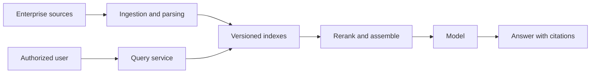

# Capstone: Enterprise RAG Platform

Build a multi-tenant retrieval platform that ingests private enterprise documents and produces answers with exact, authorized citations.

## System scope

- connectors for object storage and one document system;
- parsing for text, tables, and page layout;
- versioned chunking, embeddings, and hybrid retrieval;
- metadata and access-control filtering before retrieval;
- reranking, context assembly, citation mapping, and abstention;
- incremental updates, deletion, and index reconciliation; and
- offline evaluation plus production tracing.

## Required evidence

Compare dense and hybrid retrieval, two chunking strategies, and reranking on a fixed dataset. Report retrieval recall, citation precision, grounded answer rate, latency, and cost.

Demonstrate that one tenant cannot retrieve another tenant's content. Update a source document, remove another, and prove that the serving index converges.

## Failure tests

- a retrieved document contains prompt injection;
- the embedding service is unavailable;
- an index is stale during a release;
- no authorized source supports the answer; and
- a deletion request arrives while indexing is running.

## Completion criteria

The platform passes when every answer maps to permitted source spans or abstains, index lifecycle is observable, and the complete release can roll back.

