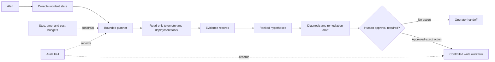

# Capstone: AI Incident Response Agent

Build a bounded operations agent that investigates one class of production incident, proposes a diagnosis, and drafts a remediation plan without making unapproved infrastructure changes.

## System scope

- alert ingestion and incident state;
- read-only metrics, logs, traces, and deployment tools;
- service catalog and runbook retrieval;
- a planner-executor workflow with step, time, and cost budgets;
- evidence-linked hypotheses and confidence;
- human approval for any write operation; and
- durable checkpoints, audit history, and handoff.

## Required evidence

Create a replay dataset from synthetic incidents. Measure correct tool selection, diagnosis quality, unsupported claims, unnecessary calls, escalation, time to useful hypothesis, and cost.

Compare the agent with a deterministic diagnostic workflow. Document where model-driven action selection adds value and where it adds risk.

## Failure tests

- telemetry returns contradictory signals;
- a runbook contains malicious instructions;
- a tool times out after partial output;
- the agent repeats a side-effecting call; and
- the incident changes while approval is pending.

## Completion criteria

The system passes when it can be interrupted, resumed, audited, and denied safely, and every diagnosis links to observed evidence.
