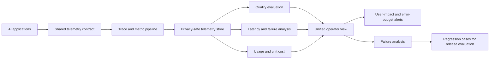

# Capstone: AI Observability Control Plane

Build an observability layer that connects model, retrieval, tool, quality, latency, and cost signals across several AI applications.

## System scope

- shared trace and metric conventions;
- release, model, prompt, index, and tool revision attributes;
- privacy-safe capture and sampling;
- quality evaluation attached to production traces;
- dashboards for task success, latency, failures, and unit cost;
- alerting based on user impact and error-budget burn; and
- failure-analysis workflow that creates regression cases.

## Required evidence

Instrument a RAG request and a tool-using workflow end to end. Show queue, retrieval, model, validation, and tool spans. Demonstrate that a responder can distinguish model degradation from stale retrieval and tool failure.

Define retention and redaction rules. Prove that sensitive prompt content does not appear in routine metrics or unprotected logs.

## Failure tests

- telemetry export is unavailable;
- generated content creates high-cardinality fields;
- one tenant attempts to read another tenant's traces;
- a release omits required version attributes; and
- quality falls while infrastructure health remains green.

## Completion criteria

The control plane passes when operators can identify affected users, failing stage, exact release, cost impact, and next diagnostic action from one incident view.
