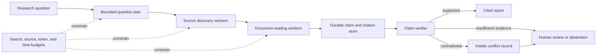

# Capstone: Multi-Agent Research System

Build a research workflow that gathers evidence, challenges claims, and produces a cited report through specialized roles.

## System scope

- research planner with a bounded question tree;
- source discovery and document-reading workers;
- claim and citation records in shared durable state;
- a verifier that checks source support and contradiction;
- explicit source-quality and freshness policy;
- human review for unresolved conflicts; and
- budgets for searches, documents, tokens, and elapsed time.

## Required evidence

Compare the multi-agent design with one structured research workflow. Measure source quality, citation support, claim coverage, contradiction handling, latency, and cost.

Document why each role needs separate context, permission, or scaling. Remove roles that do not improve measured outcomes.

## Failure tests

- two sources disagree;
- a source contains instructions aimed at the agent;
- the same source is cited through several mirrors;
- search returns no primary evidence; and
- one worker exceeds its budget or stops unexpectedly.

## Completion criteria

The system passes when every material claim links to supporting evidence, unresolved disagreement remains visible, and orchestration terminates predictably.
