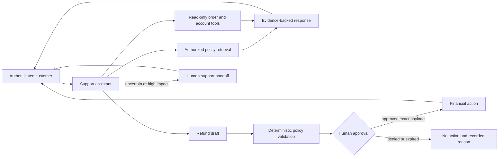

# Capstone: AI Customer Support Platform

Build a support assistant that answers policy questions, looks up customer records, drafts case updates, and requests approval for financial actions.

## System scope

- authenticated tenant and customer context;
- authorized RAG over support policy;
- read-only order and account tools;
- refund-draft tool with deterministic policy and human approval;
- conversation state, escalation, and agent handoff;
- quality, safety, latency, and cost evaluation; and
- full audit and deletion lifecycle.

## Required evidence

Evaluate answer correctness, policy citation, tool arguments, unauthorized access, escalation quality, resolution time, and cost per resolved case. Slice results by issue type and language.

Run shadow traffic before a controlled pilot. Define which outcomes can automate and which remain recommendations.

## Failure tests

- retrieved policy conflicts with the current order state;
- the user requests another customer's order;
- the model invents a refund reason;
- approval expires after the order changes; and
- the model provider fails during handoff.

## Completion criteria

The platform passes when customer data remains isolated, every policy answer is supported, financial actions require exact approval, and a human can resume with complete context.
