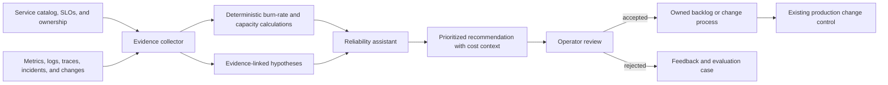

# Capstone: AI SRE Assistant

Build a reliability assistant that explains service health, evaluates error-budget burn, and proposes capacity or remediation work without changing production directly.

## System scope

- service catalog, SLO, deployment, and ownership context;
- metrics, logs, traces, incidents, and change-event tools;
- burn-rate and capacity analysis through deterministic calculations;
- model-generated summaries and prioritized hypotheses;
- review workflow for recommendations; and
- privacy-safe operational memory and audit.

## Required evidence

Evaluate alert interpretation, calculation correctness, evidence coverage, unsupported conclusions, prioritization, latency, and operator acceptance. Compare the assistant with existing dashboards and runbooks.

## Failure tests

- an SLO definition is missing or stale;
- telemetry sources disagree;
- a dashboard label contains malicious text;
- the assistant recommends capacity without cost context; and
- a user requests action outside the assistant's read-only scope.

## Completion criteria

The assistant passes when every conclusion links to current operational evidence, deterministic calculations remain reproducible, and recommendations cannot bypass change control.
