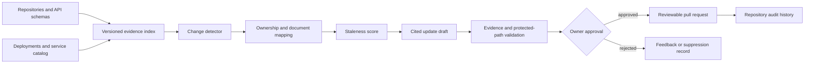

# Capstone: Documentation Intelligence Platform

Build a platform that detects stale technical documentation, drafts evidence-backed updates, and routes changes through normal repository review.

## System scope

- repository, API schema, deployment, and service-catalog ingestion;
- document-to-system ownership mapping;
- change detection and stale-content scoring;
- cited update drafts with exact source evidence;
- pull-request creation behind human approval; and
- feedback, suppression, and audit history.

## Required evidence

Create a labeled set of current and stale documents. Measure detection precision, missed changes, unsupported edits, reviewer acceptance, and time saved. Require every proposed change to cite the code, schema, or configuration that supports it.

## Failure tests

- generated code is mistaken for source code;
- two authoritative sources conflict;
- repository text attempts prompt injection;
- ownership metadata is missing; and
- a draft targets a protected document without approval.

## Completion criteria

The platform passes when it improves documentation through reviewable drafts, preserves ownership, and never publishes model output directly.
