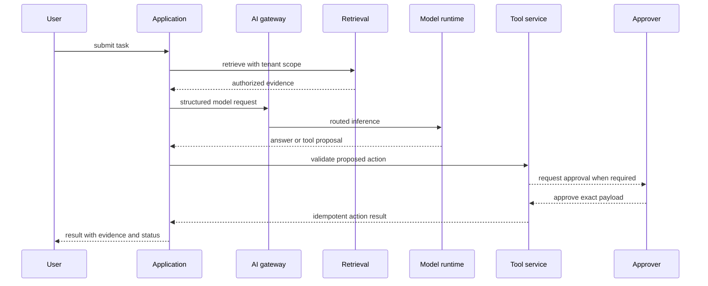

# Capstone: Production AI Platform

Design a multi-tenant knowledge and operations assistant for an enterprise. The assistant answers from authorized internal sources, calls bounded business tools, and supports human approval for consequential actions.

## Required capabilities

- document ingestion, parsing, access metadata, versioning, and deletion;
- hybrid retrieval, re-ranking, citations, and abstention;
- model gateway with routing, quotas, fallback, and cost attribution;
- tool server with typed contracts, least privilege, idempotency, and approvals;
- durable workflow state and bounded agent execution;
- offline evaluation, shadow testing, canary release, and rollback;
- identity, tenant isolation, audit records, retention, and incident response;
- observable runtime with user-centered service objectives; and
- infrastructure, deployment intent, and release evidence stored as code.

## Scenario

The enterprise has several tenants. Each tenant owns private policy documents, tickets, and operational APIs. Users can ask questions, draft changes, and request bounded actions. Some actions require approval. Data residency and retention differ by tenant.

The platform supports managed and self-hosted models, but every route must preserve tenant policy. Product teams consume the platform through a service template and stable APIs.

## Minimum service flow

## Implementation increments

### Foundation

Create repository policy, delivery pipeline, signed artifact, release manifest, infrastructure module, workload identity, baseline telemetry, and ownership metadata.

### Knowledge service

Implement ingestion, parsing, chunking, access metadata, embedding, hybrid retrieval, reranking, citation mapping, updates, and deletion. Build retrieval evaluation before adding generation.

### Model gateway

Add typed requests, model allowlists, routing, quotas, streaming, usage, timeout, fallback, and provider telemetry. Evaluate at least two routing policies.

### Agent workflow

Add read-only tools first. Introduce durable state, step and cost budgets, idempotency, and terminal reasons. Add one write tool behind exact human approval.

### Production operation

Add shadow testing, canary release, rollback, SLOs, dashboards, alerts, incident runbooks, backup restoration, tenant billing, and deletion verification.

## Architecture package

Produce:

1. a context diagram with users, systems, and trust boundaries;
2. a container or service diagram with control and data planes;
3. request and tool-call sequence diagrams;
4. data classification, lineage, retention, and deletion flows;
5. a release manifest and promotion workflow;
6. an evaluation plan with datasets, rubrics, slices, and thresholds;
7. a threat model and control matrix;
8. an SLO, capacity model, cost model, and failure budget;
9. runbooks for provider outage, bad retrieval, unsafe tool action, and data leakage; and
10. architecture decision records for the major trade-offs.

Each artifact must identify owner, revision, status, and evidence. Diagrams must match the deployed design rather than an aspirational future state.

## Repository evidence

The project repository should contain:

- source and locked dependencies;
- infrastructure and environment intent;
- schemas for APIs, tools, events, and release manifests;
- evaluation cases and runnable evaluation configuration;
- threat model and policy tests;
- dashboards, alerts, and runbooks as code where practical;
- load and resilience test scenarios;
- decision records; and
- a release report tying all evidence to one immutable version.

Never commit credentials, customer data, raw production prompts, unrestricted model artifacts, or generated evaluation reports containing sensitive content.

## Required experiments

Run controlled comparisons for:

- dense versus hybrid retrieval;
- no re-ranking versus re-ranking;
- two model-routing policies;
- workflow versus agent control for one task;
- context length versus quality, latency, and cost; and
- normal operation versus one injected dependency failure.

Record the dataset, version, result, and decision. A chart without a decision is decoration.

## Failure injection

Exercise these scenarios:

- the model provider times out after streaming begins;
- the vector store returns stale or empty results;
- a retrieved document contains malicious instructions;
- a tool receives a valid schema with an unauthorized target;
- an approval arrives after the proposed state changes;
- a tenant exceeds quota during a shared-capacity incident;
- telemetry export fails while serving continues; and
- the latest release must roll back across application, model, prompt, and index.

For each scenario, record detection, containment, user behavior, recovery, evidence, and owner.

## Evaluation gates

Define blocking thresholds for schema validity, authorization, tool safety, citation support, critical task success, and prohibited output. Define non-blocking targets for style and minor relevance.

Run the same cases against the current and candidate release. Review regressions individually even if the aggregate score improves. Calibrate model-based grading against expert labels.

## Operational gates

Load tests must cover expected and peak arrival rates, realistic prompt and output distributions, tenant skew, and dependency latency. Resilience tests verify bounded queues, timeouts, circuit breakers, fallback, and recovery.

The service objective should include user-visible success and latency. Capacity and cost reports should state assumptions and headroom.

## Readiness review

The capstone passes when the design can answer these questions without hand-waving:

- What exact release is running?
- Which data may this user retrieve?
- Why did the system choose this model and tool?
- What prevents an untrusted document from authorizing an action?
- How is quality measured before and after release?
- What happens when the provider, vector store, or tool fails?
- How is a harmful release stopped and reversed?
- Who owns the incident, customer communication, and follow-up?
- What does one successful task cost at expected and peak load?
- How can a tenant export or delete its data?

The final result should be a platform design that another team could implement and operate, not a demo architecture with missing ownership.

## Final demonstration

Demonstrate one normal task, one abstention, one approved action, one denied action, one dependency failure, one tenant-isolation test, and one rollback. Show the trace and release evidence for each.

The capstone is complete only when another team can reproduce the release from declared inputs, run the evaluations, deploy it through the supported path, and operate it with the supplied runbooks.
