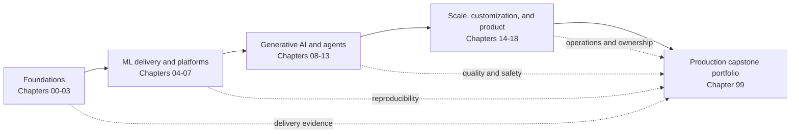

# AI Platform Engineering

A long-form learning path for engineers who build and operate the shared systems behind machine learning, generative AI, and agentic applications.

The path is organized by capability. It starts with reliable software delivery, moves through ML and AI platform design, and ends with production operations and customer integration. There are no calendar-based milestones. Move forward when you can explain the trade-offs and complete the chapter checkpoint.

## Learning outcomes

By the end of this path, you will be able to:

- design a secure delivery foundation for AI workloads;
- build reproducible training, evaluation, and deployment pipelines;
- provide self-service platform capabilities without hiding operational limits;
- operate RAG, agentic, multimodal, and fine-tuned systems;
- control quality, latency, cost, security, and compliance in production; and
- turn an AI prototype into a supportable product.

## Path

| Chapter | Capability | System outcome |
|---|---|---|
| [00](00-engineering-foundations/README.md) | Engineering foundations | A shared mental model for AI platforms |
| [01](01-delivery-and-supply-chain/README.md) | Delivery and software supply chain | A verifiable artifact promotion flow |
| [02](02-containers-kubernetes-observability/README.md) | Runtime foundations | A secure, observable Kubernetes service |
| [03](03-python-for-ai-services/README.md) | Python for AI services | A typed, tested inference API |
| [04](04-ml-lifecycle-and-reproducibility/README.md) | ML lifecycle | A reproducible experiment-to-registry flow |
| [05](05-model-delivery-and-monitoring/README.md) | Model delivery | A monitored model release pipeline |
| [06](06-infrastructure-gitops-and-platforms/README.md) | Platform engineering | A self-service golden path |
| [07](07-ai-platform-architecture/README.md) | AI platform architecture | A multi-environment reference architecture |
| [08](08-generative-ai-systems/README.md) | Generative AI systems | A governed model gateway |
| [09](09-retrieval-engineering/README.md) | Retrieval engineering | An evaluated, citation-aware RAG service |
| [10](10-agentic-systems/README.md) | Agentic systems | A bounded tool-using workflow |
| [11](11-context-tools-and-protocols/README.md) | Context, tools, and protocols | A secure tool and memory layer |
| [12](12-llmops-and-evaluation/README.md) | LLMOps and evaluation | A continuous quality feedback loop |
| [13](13-ai-security-and-governance/README.md) | Security and governance | A threat model and control plane |
| [14](14-distributed-ai-infrastructure/README.md) | Distributed AI infrastructure | A capacity-aware serving stack |
| [15](15-model-customization/README.md) | Model customization | A measured fine-tuning decision and pipeline |
| [16](16-multimodal-platforms/README.md) | Multimodal platforms | A production media-processing pipeline |
| [17](17-ai-product-engineering/README.md) | AI product engineering | A scalable product architecture |
| [18](18-forward-deployed-engineering/README.md) | Forward-deployed engineering | A production customer integration |
| [99](99-capstone/README.md) | Capstone | A complete production AI platform design |

## How to use the path

Read the chapters in order on the first pass. Build the chapter checkpoint before moving on. Keep one architecture decision record for every material choice: managed versus self-hosted, batch versus online, workflow versus agent, and retrieval versus fine-tuning.

The examples use Python, containers, Kubernetes, Terraform, and Git-based delivery. The concepts are provider-neutral. Replace a tool only when you can preserve its contract, observability, and failure handling.

## Core principle

An AI platform is successful when product teams can ship useful AI changes safely without opening infrastructure tickets for routine work. Self-service without guardrails creates incidents. Guardrails without self-service create queues. Platform engineering balances both.
